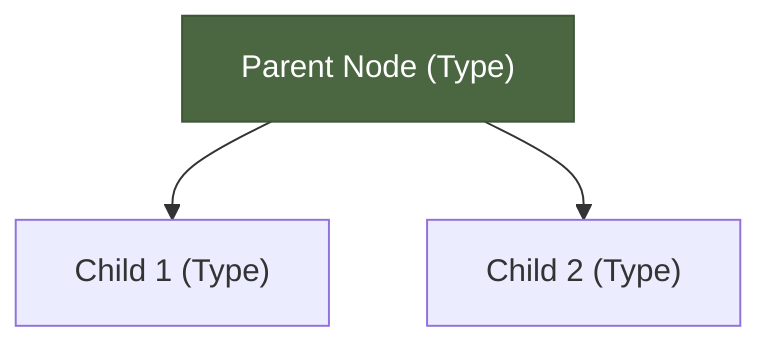
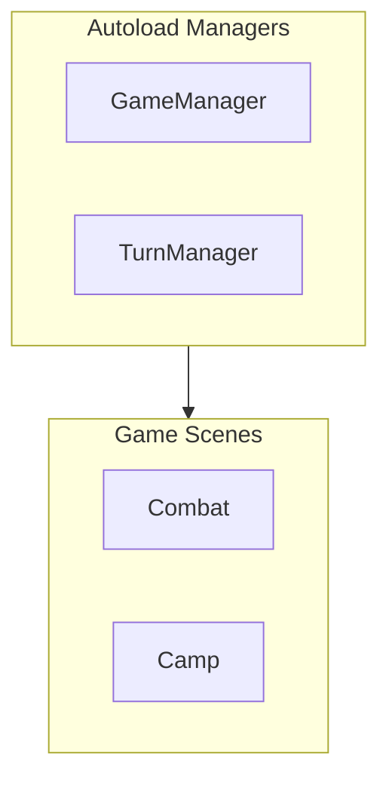
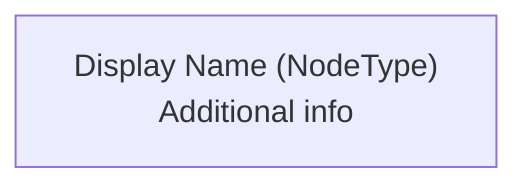
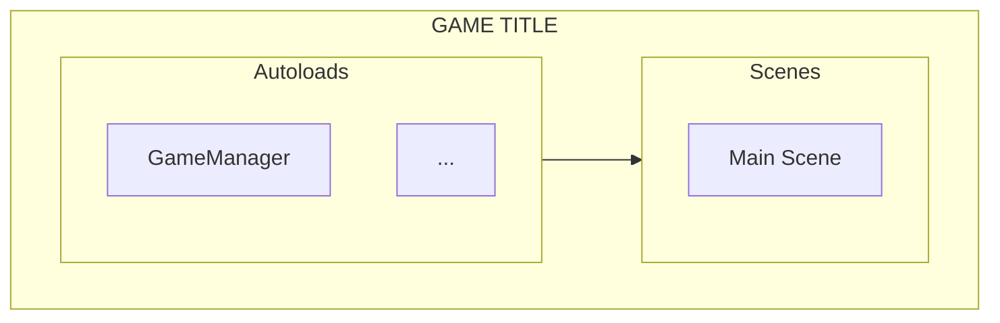
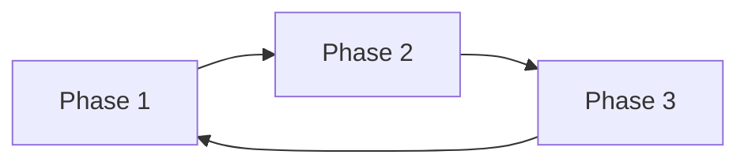
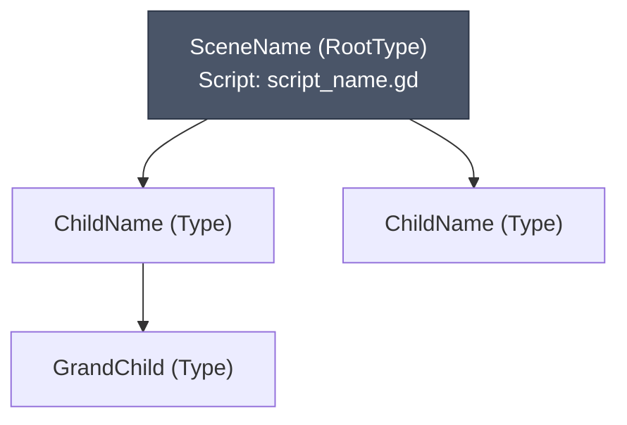
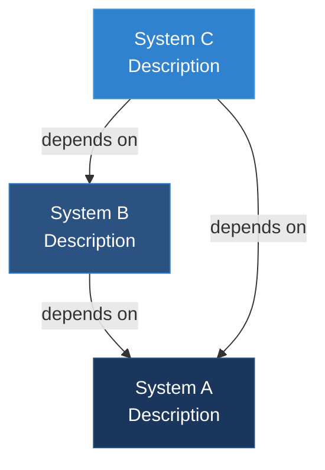
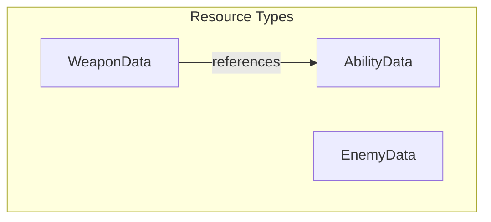

# Architecture Documenter Skill

This skill creates and maintains a comprehensive Architecture Document that visualizes scene trees, tracks data structures, maps system hierarchies, and provides a structural overview of the entire game.

## When to Use This Skill

Invoke this skill when the user:
- Says "document the architecture" or "map out the game structure"
- Asks "show me the scene tree" or "what's the scene hierarchy?"
- Wants to track data structures: "what data does the game use?"
- Says "update architecture doc" or "add [system] to architecture"
- Needs to understand node relationships
- Asks "how is [scene/system] structured?"
- Wants a visual overview of the game
- Says "create architecture document"

---

## IMPORTANT: Use Mermaid Diagrams

**All visual diagrams MUST use Mermaid syntax**, not ASCII art.

Mermaid diagrams:
- Render beautifully in GitHub, VS Code, Obsidian, and most markdown viewers
- Are easier to maintain and update
- Support colors, styling, and interactivity
- Are more readable than ASCII art

---

## Architecture Document vs Systems Bible

| Aspect | Architecture Document | Systems Bible |
|--------|----------------------|---------------|
| **Focus** | Structure & hierarchy | Implementation details |
| **Content** | Scene trees, data schemas, Mermaid diagrams | Code, APIs, methods |
| **Format** | Visual (Mermaid diagrams, tables) | Prose with code snippets |
| **Purpose** | "What exists and how it's organized" | "How things work" |
| **Updates** | When structure changes | When implementation changes |

---

## Mermaid Diagram Types to Use

### 1. Flowcharts (graph TB/LR) - For Hierarchies & Scene Trees



**Use for:**
- Scene tree hierarchies
- Class inheritance diagrams
- File structure visualization
- Data flow diagrams
- Dependency graphs

### 2. Flowcharts (graph LR) - For Sequences & Loops


**Use for:**
- Game loops
- State machines
- Signal flows
- Process sequences

### 3. Subgraphs - For Grouping Related Items



**Use for:**
- Grouping related systems
- Showing layers/categories
- Organizing complex hierarchies

### 4. Gantt Charts - For Progress/Status

```mermaid
gantt
    title Implementation Progress
    dateFormat X
    axisFormat %s

    section Completed
    Feature 1    :done, 0, 1
    Feature 2    :done, 0, 1

    section In Progress
    Feature 3    :active, 0, 1

    section Pending
    Feature 4    :0, 1
```



**Use for:**
- Implementation status
- Phase progress
- Feature completion tracking

---

## Mermaid Styling Guidelines

### Color Palette

Use consistent colors across all diagrams:

```
# Status Colors
Completed/Implemented:  fill:#48bb78,stroke:#38a169,color:#fff  (green)
In Progress:            fill:#d69e2e,stroke:#b7791f,color:#fff  (yellow/orange)
Planned/Pending:        fill:#a0aec0,stroke:#718096,color:#fff  (gray)

# Entity Type Colors
Player/Party:           fill:#3182ce,stroke:#2c5282,color:#fff  (blue)
Enemies:                fill:#e53e3e,stroke:#c53030,color:#fff  (red)
Soldiers/Allies:        fill:#38a169,stroke:#2f855a,color:#fff  (green)
Neutral/Base:           fill:#4a5568,stroke:#2d3748,color:#fff  (gray)

# Data Type Colors
Resources (.tres):      fill:#805ad5,stroke:#6b46c1,color:#fff  (purple)
JSON files:             fill:#d69e2e,stroke:#b7791f,color:#fff  (orange)
Scenes (.tscn):         fill:#3182ce,stroke:#2c5282,color:#fff  (blue)

# System Colors
Managers/Autoloads:     fill:#1a365d,stroke:#2c5282,color:#fff  (dark blue)
```

### Node Naming Convention



- Use descriptive display names
- Include node type in parentheses
- Use `<br/>` for line breaks within nodes
- Keep node IDs short for readability

---

## Architecture Document Structure

```markdown
# [GAME TITLE] - Architecture Document

**Version:** [X.Y.Z]
**Engine:** Godot [Version]
**Last Updated:** [Date]
**Phase:** [Current Phase]

---

## TABLE OF CONTENTS

1. [High-Level Architecture](#high-level-architecture)
2. [Main Scene Tree](#main-scene-tree)
3. [System Scene Trees](#system-scene-trees)
4. [Data Architecture](#data-architecture)
5. [Resource Definitions](#resource-definitions)
6. [Signal Map](#signal-map)
7. [Group Registry](#group-registry)
8. [Autoload Registry](#autoload-registry)
9. [Collision Layers](#collision-layers)
10. [File Structure](#file-structure)
11. [Implementation Status](#implementation-status)

---

## HIGH-LEVEL ARCHITECTURE

### Game Structure Overview



### Core Game Loop



...
```

---

## Workflow

### Creating New Architecture Document

1. **Scan the project structure:**
   ```
   - Glob for all .tscn files (scene trees)
   - Glob for all .tres files (resources)
   - Glob for all .gd files (scripts, esp. autoloads)
   - Check project.godot for autoloads
   ```

2. **Build scene tree documentation:**
   - Read main scene file
   - Parse node hierarchy
   - Document node types, scripts, groups
   - **Generate Mermaid graph TB diagrams for each scene**

3. **Catalog data structures:**
   - Find all Resource class definitions
   - Document exported properties
   - Map resource file locations
   - **Generate Mermaid diagrams showing data relationships**

4. **Map relationships:**
   - Signal connections
   - Group memberships
   - Collision layers
   - Autoload dependencies
   - **Use Mermaid flowcharts to show dependencies**

5. **Generate Mermaid diagrams for:**
   - High-level architecture overview
   - Scene trees (using graph TB)
   - Data flow (using graph LR)
   - Dependencies (using subgraphs)
   - Implementation status (using gantt)

6. **Save to `docs/architecture.md`**

---

### Updating Architecture Document

When the user says "update architecture":

1. **Read current architecture.md**

2. **Ask what changed:**
   - New scene added?
   - Scene restructured?
   - New data type?
   - New autoload?
   - Collision layers changed?

3. **Scan for changes:**
   - Compare file structure
   - Read modified scenes
   - Check for new resources

4. **Update appropriate sections:**
   - Add new scene trees as Mermaid diagrams
   - Update data schemas
   - Refresh dependency diagrams
   - Update file structure

5. **Add changelog entry**

---

## Mermaid Scene Tree Template

For each scene, use this template:



### Scene Tree Conventions

- Root node gets darker styling
- Implemented nodes get green styling
- Planned nodes get gray styling
- Include script name if attached
- Include groups if assigned

---

## Mermaid Dependency Graph Template

For autoloads and system dependencies:



---

## Reading .tscn Files

To extract scene tree structure for Mermaid conversion:

```gdscript
# .tscn files are text-based
# Key patterns to look for:

[node name="NodeName" type="NodeType" parent="."]
[node name="Child" type="Type" parent="NodeName"]
[node name="GrandChild" type="Type" parent="NodeName/Child"]

# Extract hierarchy from parent paths
# "." means root
# "NodeName" means direct child of that node
# "NodeName/Child" means nested path
```

**Convert to Mermaid:**
1. Create node for each `[node]` entry
2. Use `parent` to determine connections
3. Add styling based on node type/status

---

## Data Schema Extraction

When documenting Resource classes:

1. Find class definition:
   ```gdscript
   class_name WeaponData
   extends Resource
   ```

2. Extract all @export variables:
   ```gdscript
   @export var damage: int
   @export var fire_rate: float
   ```

3. Document in table format (tables render well alongside Mermaid)

4. Show relationships between resources using Mermaid:



---

## Example Invocations

User: "Create architecture document"
User: "Document the scene tree for player.tscn"
User: "Update architecture - I added a new enemy type"
User: "Show me all data types in the game"
User: "What's the collision layer setup?"
User: "Map out the autoload dependencies"
User: "Document the signal architecture"

---

## Output Location

**Primary file:** `docs/architecture.md`

**Alternative locations:**
- `docs/game-architecture.md`
- `docs/technical/architecture.md`

Always check if file exists before creating. If exists, update rather than overwrite.

---

## Quality Checklist

Before finalizing:
- [ ] All major scenes have Mermaid tree diagrams
- [ ] Mermaid diagrams use consistent color styling
- [ ] Data schemas include all @export properties
- [ ] Dependency graphs show all autoload relationships
- [ ] Groups are all documented with purpose
- [ ] Autoloads match project.godot
- [ ] File structure reflects actual project
- [ ] Implementation status uses gantt or progress diagram
- [ ] Changelog entry added

---

## Integration with Other Skills

### With `systems-bible-updater`
- Architecture doc shows STRUCTURE (Mermaid diagrams)
- Systems bible shows IMPLEMENTATION (code snippets)
- Cross-reference between them

### With `scene-optimizer`
- Architecture doc shows current structure
- Optimizer suggests improvements
- Update architecture after optimization

### With `system-diagram-generator`
- Both use Mermaid diagrams
- Architecture doc is the source of truth
- System diagrams can be extracted for presentations

---

This skill ensures the game's structural organization is always documented with clear, visual Mermaid diagrams that are easy to maintain and understand.
