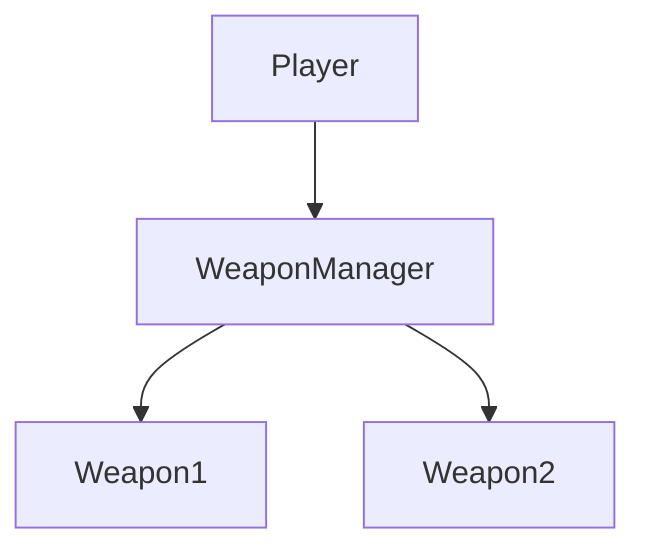
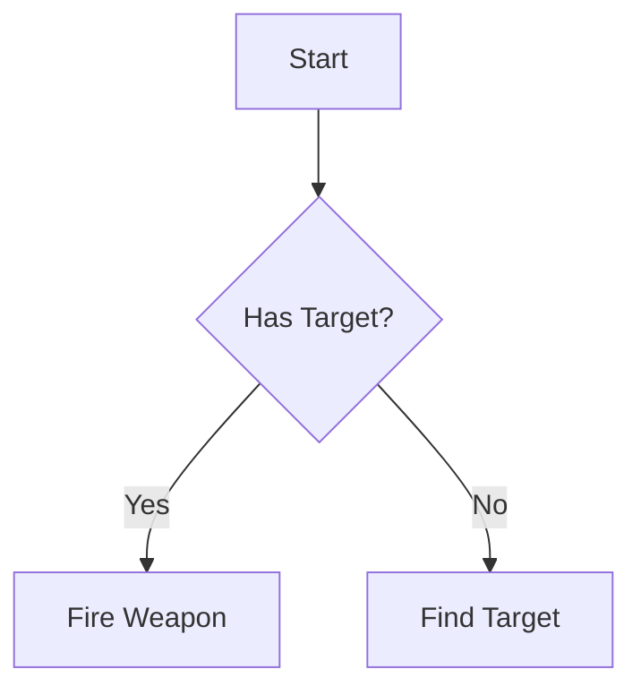
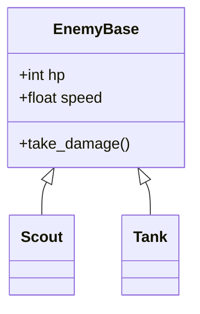
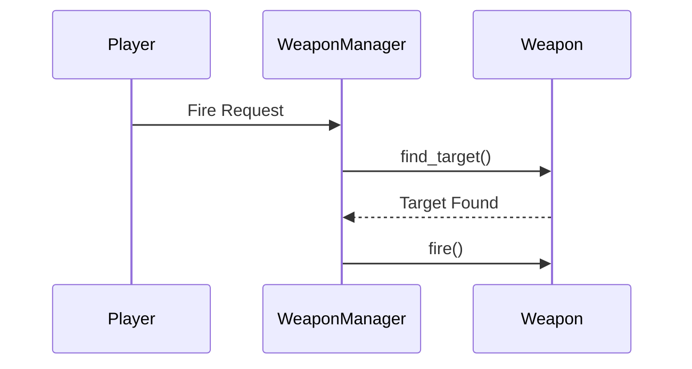
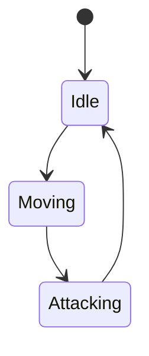
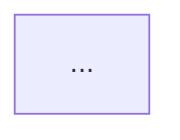
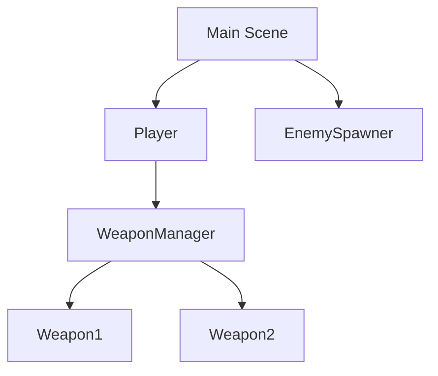
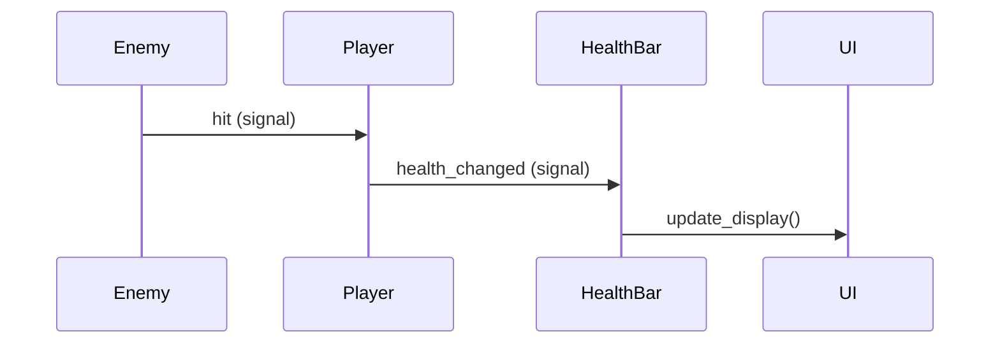
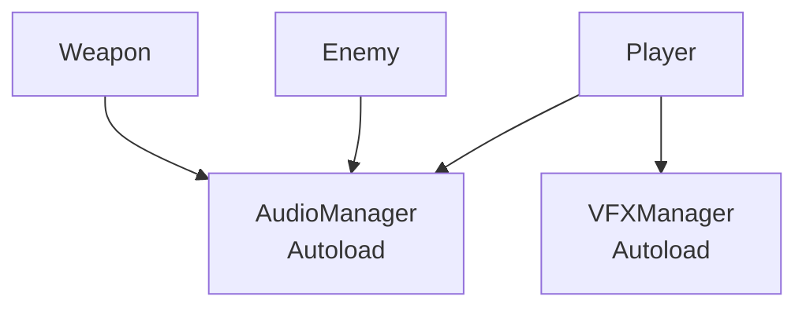

# System Diagram Generator

Analyzes game systems and code structure to create visual diagrams (Mermaid and ASCII).

## When to Use This Skill

Use this skill when the user requests:
- **Architecture diagrams** - "Show me how the weapon system is structured"
- **Flowcharts** - "Diagram the enemy spawning logic"
- **Data flow diagrams** - "How does damage flow through the system?"
- **Class relationships** - "Show the inheritance hierarchy for enemies"
- **State diagrams** - "Diagram the player's state machine"
- **Sequence diagrams** - "Show how a weapon fires from start to finish"
- **System overviews** - "Explain how the upgrade system works visually"

**Keywords to watch for:** diagram, visualize, show flow, architecture, how does [system] work, map out, chart

## Diagram Types Supported

### 1. Architecture Diagram (Mermaid graph)
- Shows high-level system components and relationships
- Best for: System overviews, module dependencies, data flow


### 2. Flowchart (Mermaid flowchart)
- Shows decision logic and process flow
- Best for: Algorithms, game loop, conditional logic


### 3. Class Diagram (Mermaid classDiagram)
- Shows class inheritance, properties, methods
- Best for: OOP structure, inheritance hierarchies


### 4. Sequence Diagram (Mermaid sequenceDiagram)
- Shows interactions over time
- Best for: Event sequences, message passing


### 5. State Diagram (Mermaid stateDiagram)
- Shows state transitions
- Best for: FSM, game states, entity states


### 6. ASCII Diagram (text-based)
- Simple box-and-arrow diagrams
- Best for: Quick overviews, terminal viewing
```
┌─────────────┐
│   Player    │
└──────┬──────┘
       │
       ▼
┌─────────────┐
│   Weapon    │
└─────────────┘
```

## Analysis Process

### Step 1: Understand the Request
- Identify which system(s) to diagram
- Determine appropriate diagram type(s)
- Ask clarifying questions if scope is unclear

### Step 2: Gather Code Context
Use tools to analyze the codebase:
```gdscript
# Find relevant files
Glob: "scripts/weapons/*.gd"
Glob: "scripts/enemies/*.gd"

# Read key files
Read: scripts/weapons/weapon_base.gd
Read: scripts/systems/weapon_manager.gd

# Search for patterns
Grep: "extends.*Base" (find inheritance)
Grep: "signal.*" (find signal connections)
Grep: "@export.*" (find exported properties)
```

### Step 3: Create Diagram(s)
- Generate both Mermaid (for rendering) and ASCII (for terminals) when appropriate
- Include explanatory notes and legends
- Add code references (file:line) for key components

### Step 4: Output to File
Write diagrams to `docs/diagrams/[system-name]_diagram_[date].md`

**File naming convention:**
- `weapon-system_diagram_2025-12-21.md`
- `enemy-spawning_flowchart_2025-12-21.md`
- `upgrade-system_architecture_2025-12-21.md`

## Output Format

```markdown
---
diagram_date: YYYY-MM-DD
system: [System Name]
diagram_types: [Architecture, Flowchart, Class, etc.]
generated_by: Claude Code (system-diagram-generator skill)
---

# [System Name] Diagram

**Generated:** YYYY-MM-DD
**System:** [System Name]
**Purpose:** [Brief explanation of what this diagram shows]

---

## System Overview

[1-2 paragraph explanation of the system]

---

## Architecture Diagram



**Key Components:**
- **ComponentA** (path/to/file.gd:123) - Description
- **ComponentB** (path/to/file.gd:456) - Description

---

## Flowchart: [Process Name]


**Process Steps:**
1. Step explanation
2. Step explanation

---

## ASCII Overview (Terminal-Friendly)

```
┌─────────────────┐
│  Component A    │
└────────┬────────┘
         │
         ▼
┌─────────────────┐
│  Component B    │
└─────────────────┘
```

---

## Key Insights

- Insight 1 about the architecture
- Insight 2 about data flow
- Insight 3 about dependencies

---

## Code References

- `scripts/systems/weapon_manager.gd:45` - Weapon initialization
- `scripts/weapons/weapon_base.gd:101` - Fire logic
- `scripts/systems/player.gd:67` - Weapon trigger

---

*This diagram was generated by Claude Code's system-diagram-generator skill on [date].*
```

## Diagram Best Practices

### Clarity
- **Keep it simple** - Don't try to show everything in one diagram
- **Use consistent naming** - Match code names exactly
- **Add legends** - Explain symbols and colors
- **Limit depth** - 3-4 levels max for architecture diagrams

### Accuracy
- **Verify with code** - Always read actual source files, don't guess
- **Include file references** - Add (file:line) citations for key components
- **Note assumptions** - If inferring behavior, state it clearly
- **Date diagrams** - Code changes, diagrams become stale

### Usefulness
- **Focus on requested aspect** - If user asks about weapon targeting, focus on that
- **Highlight critical paths** - Bold or color important flows
- **Show data flow** - Use arrows to indicate direction of data/control
- **Add context** - Brief explanations of each component

## Godot-Specific Patterns to Recognize

### Scene Tree Structure


### Signal Connections


### Autoload Singletons


### Resource-Based Systems


## Example Usage Patterns

### User: "Diagram how my weapon targeting system works"

**Process:**
1. Use Glob to find weapon-related files
2. Read `weapon_base.gd`, `weapon_manager.gd`
3. Search for targeting logic with Grep
4. Create flowchart showing targeting decision process
5. Create sequence diagram showing interactions
6. Output to `docs/diagrams/weapon-targeting_diagram_[date].md`

### User: "Show the enemy inheritance hierarchy"

**Process:**
1. Use Grep to find all `extends EnemyBase`
2. Read `enemy_base.gd` to understand base class
3. Read each enemy script to identify unique features
4. Create class diagram showing inheritance and properties
5. Add architecture diagram showing relationships
6. Output to `docs/diagrams/enemy-hierarchy_diagram_[date].md`

### User: "How does the upgrade system work?"

**Process:**
1. Search for upgrade-related files and code
2. Trace data flow from UI → Manager → Application
3. Create architecture diagram of components
4. Create flowchart of upgrade application logic
5. Create state diagram if applicable
6. Output to `docs/diagrams/upgrade-system_diagram_[date].md`

## Important Constraints

### DO:
- ✅ Always read actual source code before diagramming
- ✅ Include file:line references for components
- ✅ Generate both Mermaid and ASCII when appropriate
- ✅ Add explanatory text with diagrams
- ✅ Save diagrams to `docs/diagrams/` directory
- ✅ Ask clarifying questions if request is ambiguous

### DON'T:
- ❌ Don't guess at code structure - always verify
- ❌ Don't create overly complex diagrams (split into multiple)
- ❌ Don't use Bash commands - use Read/Grep tools
- ❌ Don't diagram without understanding the actual code
- ❌ Don't forget to date and document diagrams

## Success Criteria

A good diagram should:
1. **Answer the user's question** clearly and visually
2. **Be verifiable** with code references
3. **Be maintainable** with clear documentation
4. **Be accessible** with both rendered and ASCII versions
5. **Be educational** with explanatory notes

---

## Skill Activation Examples

**User says:**
- "Diagram the weapon system"
- "Show me how enemy spawning works"
- "Visualize the upgrade flow"
- "Create a flowchart for weapon targeting"
- "Map out the player's state machine"
- "How does damage calculation work? Show me"
- "Architecture diagram for the wave system"

**Claude should:**
1. Acknowledge the request
2. Identify which diagram type(s) are appropriate
3. Use Read/Glob/Grep to analyze code
4. Generate diagram(s) with explanations
5. Write to `docs/diagrams/[name]_diagram_[date].md`
6. Show a preview of the diagram in chat
7. Provide the file path for reference

---

*This skill enables rapid visual understanding of complex game systems and code architecture.*
