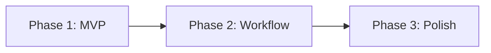

# Tool Roadmap Planner Skill

This skill creates phased implementation roadmaps for development tools. Takes a tool spec and breaks it into concrete, actionable phases with clear deliverables. No time estimates - just logical sequencing.

## When to Use This Skill

Invoke this skill when the user:
- Has a tool spec and wants to plan implementation
- Says "create roadmap for [tool]" or "plan [tool] development"
- Asks "how should I build this tool?"
- Wants to break a tool into MVP and future phases
- Says "roadmap" after creating a tool spec

---

## Roadmap Philosophy

### Phase Structure


### Phase Goals

| Phase | Goal | Exit Criteria |
|-------|------|---------------|
| **MVP** | Tool is usable for its core purpose | Primary workflow works end-to-end |
| **Workflow** | Tool is efficient to use daily | No friction in common operations |
| **Polish** | Tool handles edge cases gracefully | Ready for other team members |

---

## Roadmap Generation Process

### Step 1: Read Tool Spec

If spec exists at `docs/tools/[tool-name]-spec.md`:
- Extract MVP features
- Extract nice-to-have features
- Note success criteria
- Identify technical constraints

If no spec exists:
- Prompt user to run `tool-spec-generator` first
- Or gather minimal requirements inline

### Step 2: Define Phases

Break features into phases following the MVP → Workflow → Polish pattern.

### Step 3: Create Deliverables

For each phase, list concrete deliverables that can be checked off.

---

## Roadmap Template

```markdown
# Tool Roadmap: [Tool Name]

**Spec:** `docs/tools/[tool-name]-spec.md`
**Created:** [Date]
**Implementer:** Use `tool-feature-implementer` skill to build features

---

## Overview



**Goal:** [One sentence - what this tool enables]

---

## Phase 1: MVP (Minimum Viable Tool)

**Goal:** [Core functionality works end-to-end]

**Exit Criteria:** [When to move to Phase 2]

### Features

#### Feature 1.1: [Feature Name]
**Description:** [What this feature does - 1-2 sentences]

**Implementation Tasks:**
- [ ] [Concrete task - create scene, script, etc.]
- [ ] [Concrete task]
- [ ] [Concrete task]

**Files to Create/Modify:**
- `addons/[plugin]/scenes/[file].tscn`
- `addons/[plugin]/scripts/[file].gd`

**Success Criteria:**
- [ ] [Testable criterion]
- [ ] [Testable criterion]

---

#### Feature 1.2: [Feature Name]
**Description:** [What this feature does]

**Dependencies:** Feature 1.1 (if any)

**Implementation Tasks:**
- [ ] [Task]
- [ ] [Task]

**Files to Create/Modify:**
- [Files]

**Success Criteria:**
- [ ] [Criterion]

---

#### Feature 1.3: [Feature Name]
[Same structure...]

---

### Phase 1 Technical Setup
- [ ] Create `addons/[plugin_name]/` directory structure
- [ ] Create `plugin.cfg` with metadata
- [ ] Create `plugin.gd` EditorPlugin base
- [ ] Enable plugin in Project Settings

---

## Phase 2: Workflow Improvements

**Goal:** [Make daily use efficient]

**Prerequisites:** Phase 1 complete

### Features

#### Feature 2.1: [Feature Name]
**Description:** [What this feature does]

**Implementation Tasks:**
- [ ] [Task]

**Files to Create/Modify:**
- [Files]

**Success Criteria:**
- [ ] [Criterion]

---

#### Feature 2.2: [Feature Name]
[Same structure...]

---

## Phase 3: Polish & Edge Cases

**Goal:** [Production-ready, handles edge cases]

**Prerequisites:** Phase 2 complete, used in real workflows

### Features

#### Feature 3.1: [Feature Name]
[Same structure...]

---

### Phase 3 Documentation
- [ ] Create usage guide in `docs/tools/[tool-name]-guide.md`
- [ ] Document known limitations
- [ ] Add inline code comments for complex logic

---

## Future Ideas (Backlog)

Ideas that might be valuable but aren't committed:

- [Idea 1]
- [Idea 2]
- [Idea 3]

---

## Dependencies

| Dependency | Required By | Notes |
|------------|-------------|-------|
| [Dependency] | Feature X.Y | [Notes] |

---

## Risk Mitigation

| Risk | Impact | Mitigation |
|------|--------|------------|
| [Risk] | [Impact] | [How to handle] |
```

---

## Feature Format Guidelines

Each feature in the roadmap should include:

1. **Feature ID:** `X.Y` format (Phase.Number)
2. **Description:** 1-2 sentences explaining what it does
3. **Dependencies:** Other features that must be complete first
4. **Implementation Tasks:** Concrete, actionable items
5. **Files to Create/Modify:** Specific file paths
6. **Success Criteria:** Testable completion conditions

### Good Feature Example

```markdown
#### Feature 1.2: Visual Node Canvas
**Description:** GraphEdit-based canvas for placing and connecting dialogue nodes with pan/zoom support.

**Dependencies:** Feature 1.1 (Plugin Setup)

**Implementation Tasks:**
- [ ] Create `main_panel.tscn` with GraphEdit as root
- [ ] Configure GraphEdit properties (grid, snapping, minimap)
- [ ] Implement connection_request signal handler
- [ ] Implement disconnection_request signal handler
- [ ] Add right-click context menu for node creation
- [ ] Implement pan (middle-click) and zoom (scroll wheel)

**Files to Create/Modify:**
- `addons/dialogue_editor/scenes/main_panel.tscn`
- `addons/dialogue_editor/scripts/dialogue_canvas.gd`

**Success Criteria:**
- [ ] Canvas displays in editor main screen
- [ ] Can pan canvas with middle mouse button
- [ ] Can zoom with scroll wheel
- [ ] Grid and snapping work correctly
```

### Bad Feature Example (Too Vague)

```markdown
#### Feature 1.2: Canvas
**Description:** Add a canvas

**Implementation Tasks:**
- [ ] Make it work

**Success Criteria:**
- [ ] It works
```

---

## Phase Breakdown Guidelines

### Phase 1: MVP - What Goes Here

**Include:**
- Core functionality that makes the tool useful
- Minimum UI to operate the tool
- Basic file I/O
- Happy path only (no error handling)

**Exclude:**
- Shortcuts and conveniences
- Polish and animations
- Error handling for edge cases
- Configuration options

**Rule of thumb:** If you could use the tool with this phase only (even if clunky), it's MVP.

### Phase 2: Workflow - What Goes Here

**Include:**
- Keyboard shortcuts
- Drag-and-drop
- Auto-refresh/live updates
- Sorting, filtering, search
- Recent files / history
- Undo/redo
- Status indicators

**Exclude:**
- Edge case handling
- Documentation
- Settings/preferences
- Multi-user support

**Rule of thumb:** Features that save clicks and time.

### Phase 3: Polish - What Goes Here

**Include:**
- Error handling and recovery
- Edge cases (empty data, corrupted files)
- Loading states and feedback
- Settings and preferences
- Documentation
- Performance optimization

**Rule of thumb:** Things you'd be embarrassed to ship without.

---

## Examples by Tool Type

### Editor Plugin Roadmap Example

```markdown
# Tool Roadmap: Balance Dashboard Dock

**Spec:** `docs/tools/balance-dashboard-spec.md`
**Implementer:** Use `tool-feature-implementer` skill

## Phase 1: MVP

**Goal:** View weapon and enemy stats in a dock

### Features

#### Feature 1.1: Plugin Setup
**Description:** Create the basic editor plugin structure and register the dock.

**Implementation Tasks:**
- [ ] Create `addons/balance_dashboard/` directory
- [ ] Create `plugin.cfg` with metadata
- [ ] Create `plugin.gd` that adds dock to editor
- [ ] Create `dock.tscn` with VBoxContainer layout

**Files to Create/Modify:**
- `addons/balance_dashboard/plugin.cfg`
- `addons/balance_dashboard/plugin.gd`
- `addons/balance_dashboard/scenes/dock.tscn`

**Success Criteria:**
- [ ] Plugin appears in Project Settings > Plugins
- [ ] Dock appears in editor when plugin enabled

---

#### Feature 1.2: Data Loading
**Description:** Scan project for WeaponData and EnemyData resources and load them.

**Dependencies:** Feature 1.1

**Implementation Tasks:**
- [ ] Create `data_scanner.gd` utility script
- [ ] Implement recursive directory scanning for .tres files
- [ ] Filter by resource type (WeaponData, EnemyData)
- [ ] Cache loaded resources in memory

**Files to Create/Modify:**
- `addons/balance_dashboard/scripts/data_scanner.gd`

**Success Criteria:**
- [ ] Finds all WeaponData resources in `data/weapons/`
- [ ] Finds all EnemyData resources in `data/enemies/`

---

#### Feature 1.3: Weapon Table
**Description:** Display all weapons in a sortable table with key stats.

**Dependencies:** Feature 1.2

**Implementation Tasks:**
- [ ] Add Tree node to dock for weapon display
- [ ] Create columns: Name, Damage, Fire Rate, DPS
- [ ] Populate table from scanned WeaponData
- [ ] Calculate DPS column (damage * fire_rate)

**Files to Create/Modify:**
- `addons/balance_dashboard/scenes/dock.tscn`
- `addons/balance_dashboard/scripts/weapon_table.gd`

**Success Criteria:**
- [ ] All weapons display in table
- [ ] DPS calculation is correct
- [ ] Table scrolls if many weapons

---

## Phase 2: Workflow Improvements

**Goal:** Efficient daily balance work

### Features

#### Feature 2.1: Sort by Column
**Description:** Click column headers to sort ascending/descending.

**Implementation Tasks:**
- [ ] Connect column header click signals
- [ ] Implement sort function for each column type
- [ ] Add sort indicator arrow to header

**Success Criteria:**
- [ ] Clicking header sorts by that column
- [ ] Clicking again reverses sort order

---

## Phase 3: Polish

### Features

#### Feature 3.1: Export to CSV
**Description:** Export current table view to CSV for spreadsheet analysis.

**Implementation Tasks:**
- [ ] Add "Export CSV" button to toolbar
- [ ] Implement CSV generation from table data
- [ ] Open file dialog for save location

**Success Criteria:**
- [ ] CSV opens correctly in Excel/Sheets
- [ ] All visible columns included
```

### CLI Tool Roadmap Example

```markdown
# Tool Roadmap: Dialogue Validator

**Spec:** `docs/tools/dialogue-validator-spec.md`
**Implementer:** Use `tool-feature-implementer` skill

## Phase 1: MVP

**Goal:** Validate dialogue JSON files

### Features

#### Feature 1.1: Argument Parsing
**Description:** Parse command line arguments for file/folder paths and options.

**Implementation Tasks:**
- [ ] Create main script with `_init()` entry point
- [ ] Parse positional arguments for input path
- [ ] Add `--help` flag for usage info
- [ ] Validate input path exists

**Files to Create/Modify:**
- `tools/dialogue_validator/dialogue_validator.gd`

**Success Criteria:**
- [ ] `godot --script dialogue_validator.gd path/to/file.json` works
- [ ] `--help` prints usage information
- [ ] Error message if path doesn't exist

---

#### Feature 1.2: JSON Parsing & Syntax Check
**Description:** Load JSON files and report syntax errors.

**Dependencies:** Feature 1.1

**Implementation Tasks:**
- [ ] Load JSON file with FileAccess
- [ ] Parse with JSON.parse_string()
- [ ] Capture and format parse errors
- [ ] Report line number of syntax errors

**Success Criteria:**
- [ ] Valid JSON parses without error
- [ ] Invalid JSON reports line number

---

#### Feature 1.3: Node Reference Validation
**Description:** Verify all node_id references point to existing nodes.

**Dependencies:** Feature 1.2

**Implementation Tasks:**
- [ ] Build dictionary of all node IDs
- [ ] Scan all "next" references in nodes
- [ ] Report missing references with context

**Success Criteria:**
- [ ] Catches reference to non-existent node
- [ ] Reports which node contains bad reference

---

## Phase 2: Workflow Improvements

**Goal:** Useful in development workflow

### Features

#### Feature 2.1: Orphan Node Detection
**Description:** Find nodes that are never referenced (unreachable).

**Implementation Tasks:**
- [ ] Build graph of node connections
- [ ] Traverse from start node
- [ ] Report nodes not visited

**Success Criteria:**
- [ ] Identifies orphaned nodes
- [ ] Doesn't flag intentionally disconnected nodes

---

## Phase 3: Polish

### Features

#### Feature 3.1: CI/CD Integration
**Description:** Enable use in automated pipelines with proper exit codes.

**Implementation Tasks:**
- [ ] Exit code 0 for all valid
- [ ] Exit code 1 for validation errors
- [ ] Exit code 2 for runtime errors
- [ ] Add `--json` output format for parsing

**Success Criteria:**
- [ ] Works in GitHub Actions workflow
- [ ] JSON output parseable by other tools
```

---

## Output Location

Save roadmaps to: `docs/tools/[tool-name]-roadmap.md`

**Examples:**
- `docs/tools/balance-dashboard-roadmap.md`
- `docs/tools/dialogue-validator-roadmap.md`

---

## Workflow Summary

1. User says "create roadmap for [tool]" or runs after tool-spec-generator
2. Read tool spec if exists
3. Ask clarifying questions if needed
4. Generate roadmap with 3 phases
5. Display in chat
6. Save to `docs/tools/[name]-roadmap.md`

---

## Integration with Other Skills

### With `tool-spec-generator`
- Spec defines WHAT (features, success criteria)
- Roadmap defines HOW (phased delivery)
- Natural flow: spec → roadmap → implementation

### With `changelog-updater`
- As phases complete, update changelog
- Track tool versions separately from game

### With `architecture-documenter`
- Document tool architecture if complex
- Add to project architecture if it integrates deeply

---

This skill ensures tools are built incrementally with clear milestones, avoiding scope creep and ensuring value at each phase.
