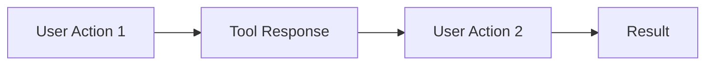

# Tool Spec Generator Skill

This skill generates structured, moderate-detail specifications for development tools, editor plugins, and standalone utilities. Keeps specs concise (~1-2 pages) while capturing enough detail to guide implementation.

## When to Use This Skill

Invoke this skill when the user:
- Says "I need a tool for..." or "create a tool spec"
- Wants to plan an editor plugin
- Says "spec out [tool name]"
- Needs to document a utility before building it
- Asks "help me plan a [tool/editor/utility]"

---

## Tool Types Supported

### 1. Godot Editor Plugins
- Docks (side panels)
- Inspector plugins (custom property editors)
- Main screen plugins (full editor tabs)
- Import plugins
- Export plugins
- EditorScript utilities

### 2. Standalone Tools
- Balance spreadsheet viewers
- Asset pipeline tools
- Data editors (JSON/Resource editors)
- Build/export automation
- Analytics dashboards

### 3. CLI Utilities
- Asset processing scripts
- Code generation tools
- Validation/linting tools
- Automation scripts

---

## Spec Generation Process

### Step 1: Gather Requirements (Interactive)

Ask the user:
1. **What problem does this tool solve?** (Pain point)
2. **Who will use it?** (Designer, programmer, artist, QA)
3. **What type of tool?** (Editor plugin, standalone, CLI)
4. **What's the core workflow?** (Main user actions)

### Step 2: Generate Spec

Use the template below, filling in based on user answers and your analysis.

---

## Tool Spec Template

```markdown
# Tool Spec: [Tool Name]

**Version:** 0.1
**Type:** [Editor Plugin / Standalone / CLI]
**Priority:** [High / Medium / Low]
**Created:** [Date]

---

## Problem Statement

**Pain Point:**
[One sentence describing the problem this tool solves]

**Current Workaround:**
[How is this done today without the tool?]

**Impact:**
[Why is solving this worth the effort?]

---

## Target Users

| User | Use Case |
|------|----------|
| [Role] | [What they do with this tool] |

---

## Core Functionality (MVP)

### Must Have
1. **[Feature]** - [Brief description]
2. **[Feature]** - [Brief description]
3. **[Feature]** - [Brief description]

### Nice to Have (Post-MVP)
- [Feature idea]
- [Feature idea]

---

## User Workflow



**Primary Flow:**
1. User [action]
2. Tool [response]
3. User [action]
4. Tool [result]

---

## UI/UX Design

### Layout
[Description or simple ASCII/Mermaid mockup]

```
┌─────────────────────────────────┐
│  [Header/Toolbar]               │
├─────────────────────────────────┤
│  [Main Content Area]            │
│                                 │
├─────────────────────────────────┤
│  [Status Bar / Actions]         │
└─────────────────────────────────┘
```

### Key UI Elements
| Element | Purpose |
|---------|---------|
| [Element] | [What it does] |

### Interactions
- [Interaction 1]: [Behavior]
- [Interaction 2]: [Behavior]

---

## Technical Notes

### Integration Points
- **Godot API:** [Relevant classes/methods]
- **File System:** [What files it reads/writes]
- **Other Tools:** [Dependencies on other tools]

### Data Format
[If the tool uses custom data formats]

```gdscript
# Example structure
{
    "key": "value"
}
```

### Constraints
- [Technical constraint or limitation]
- [Performance consideration]

---

## Success Criteria

**MVP Complete When:**
- [ ] [Testable criterion]
- [ ] [Testable criterion]
- [ ] [Testable criterion]

**Tool is Successful When:**
- [Qualitative measure - e.g., "Reduces balance iteration time by 50%"]

---

## Open Questions

- [ ] [Unresolved question]
- [ ] [Decision to be made]

---

## References

- [Link to related docs, inspiration, similar tools]
```

---

## Spec Detail Guidelines

### Keep It Concise
- Problem statement: 1-3 sentences
- MVP features: 3-5 bullet points max
- Workflow: 4-6 steps max
- UI description: Simple mockup + key elements table

### Focus On
- **Why** this tool exists (problem)
- **What** it does (MVP features)
- **How** users interact (workflow)
- **When** it's done (success criteria)

### Avoid
- Implementation details (save for Systems Bible)
- Exhaustive feature lists
- Premature optimization concerns
- Over-specified UI (iterate during development)

---

## Examples by Tool Type

### Editor Plugin Example

```markdown
# Tool Spec: Balance Dashboard Dock

**Type:** Editor Plugin (Dock)
**Priority:** High

## Problem Statement
**Pain Point:** Weapon and enemy stats are scattered across multiple .tres files, making balance comparison difficult.

**Current Workaround:** Manually open each resource file, copy values to spreadsheet.

**Impact:** Balance iteration takes 30+ minutes per cycle. A dashboard could reduce this to seconds.

## Target Users
| User | Use Case |
|------|----------|
| Designer | Compare weapon DPS, spot outliers |
| Programmer | Verify balance changes after code updates |

## Core Functionality (MVP)
1. **Weapon Table** - Display all weapons with key stats (damage, fire rate, DPS)
2. **Enemy Table** - Display all enemies with key stats (HP, damage, speed)
3. **Sort/Filter** - Sort by any column, filter by type

## User Workflow
1. Open Balance Dashboard dock in editor
2. View all weapons/enemies in sortable tables
3. Click row to open resource file
4. Edit resource, dashboard auto-refreshes

## Success Criteria
- [ ] Displays all WeaponData and EnemyData resources
- [ ] Calculates derived stats (DPS, TTK)
- [ ] Sorts by any column
- [ ] Opens resource on double-click
```

### Standalone Tool Example

```markdown
# Tool Spec: Dialogue Tree Validator

**Type:** Standalone (CLI + optional GUI)
**Priority:** Medium

## Problem Statement
**Pain Point:** Dialogue JSON files can have broken node references, missing conditions, or orphaned branches that only surface at runtime.

**Current Workaround:** Manually trace dialogue paths, test in-game.

**Impact:** Broken dialogue discovered during playtests wastes everyone's time.

## Core Functionality (MVP)
1. **Parse Check** - Validate JSON syntax
2. **Reference Check** - Verify all node IDs exist
3. **Orphan Detection** - Find unreachable nodes
4. **Report** - Output issues with file:line references

## Success Criteria
- [ ] Catches missing node references
- [ ] Identifies orphan nodes
- [ ] Runs in <1 second for all dialogue files
- [ ] Exit code 0/1 for CI integration
```

---

## Output Location

Save specs to: `docs/tools/[tool-name]-spec.md`

**Examples:**
- `docs/tools/balance-dashboard-spec.md`
- `docs/tools/dialogue-validator-spec.md`
- `docs/tools/asset-importer-spec.md`

---

## Workflow Summary

1. User says "I need a tool for X" or "create tool spec for Y"
2. Ask clarifying questions (problem, users, type, workflow)
3. Generate spec using template
4. Display in chat
5. Save to `docs/tools/[name]-spec.md`
6. Offer to create roadmap with `tool-roadmap-planner`

---

## Integration with Other Skills

### With `tool-roadmap-planner`
- Spec defines WHAT the tool does
- Roadmap defines HOW to build it in phases
- After spec approval, run roadmap planner

### With `editor-plugin-scaffolder` (if created)
- Spec defines requirements
- Scaffolder creates initial plugin structure
- Implementation follows spec

---

This skill ensures tools are planned before built, with clear success criteria and focused scope.
