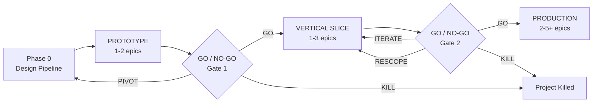
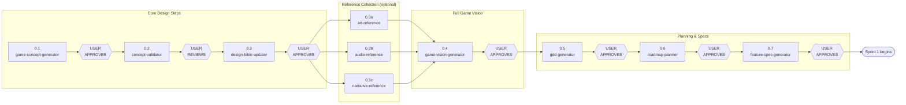
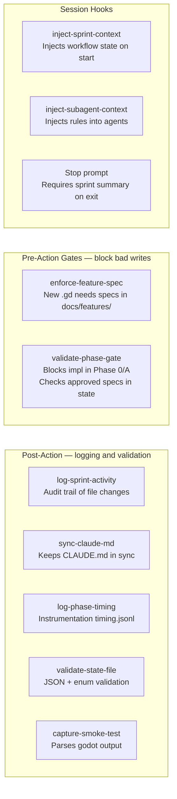
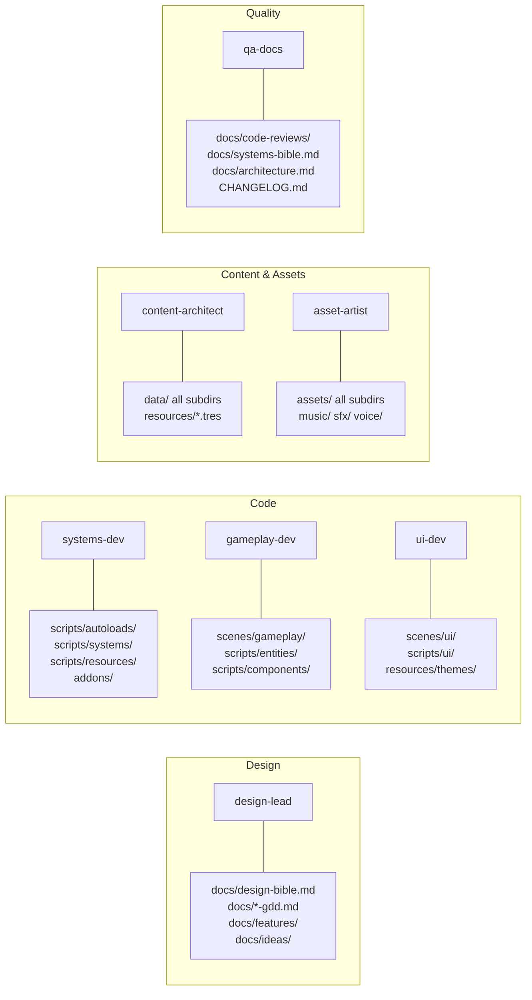

# Agent Team Workflow

A structured approach to AI-assisted game development using coordinated agent teams. This document defines agent roles, tool ownership, sprint structure, quality gates, and user control points.

---

### Metadata Requirements

All agents must maintain structured YAML frontmatter metadata in agent files and feature specs. This metadata is read by GameForge for project tracking and visualization. See the "GameForge Metadata Contract" section in CLAUDE.md for the complete specification.

---

## Workflow Overview

### Development Lifecycle



### Phase 0: Design Pipeline



### Sprint Structure (Phases A through D)

```mermaid
graph TB
    subgraph A["PHASE A — Spec & Foundation"]
        direction LR
        A_AGENTS["Agents: design-lead<br/>systems-dev, asset-artist"]
        A_WORK["Specs finalized<br/>Foundation APIs built<br/>Asset generation started"]
        A_GATE{{"USER APPROVES specs<br/>APIs ready"}}
        A_AGENTS --> A_WORK --> A_GATE
    end

    A_GATE --> A_COMMIT["git commit: Phase A"]

    subgraph B["PHASE B — Implementation (per feature)"]
        direction LR
        B_AGENTS["Agents: gameplay-dev<br/>ui-dev, content-architect<br/>asset-artist"]
        B_WORK["Implement feature<br/>from spec"]
        B_REPORT["Feature Completion<br/>Report to user<br/>(non-blocking)"]
        B_MORE{More<br/>features?}
        B_AGENTS --> B_WORK --> B_REPORT --> B_MORE
        B_MORE -->|Yes| B_WORK
        B_MORE -->|No| B_DONE["All features complete"]
    end

    A_COMMIT --> B
    B_DONE --> B_COMMIT["git commit: Phase B"]

    subgraph B5["PHASE B.5 — Integration Wiring (MANDATORY)"]
        direction LR
        B5_CHECK["Verify:<br/>Scene instantiation<br/>Signal connections<br/>Collision layers<br/>Autoloads, node paths<br/>Cross-feature wiring"]
        B5_SMOKE{"Smoke test<br/>godot --headless --quit"}
        B5_CHECK --> B5_SMOKE
        B5_SMOKE -->|FAIL| B5_CHECK
    end

    B_COMMIT --> B5
    B5_SMOKE -->|PASS| B5_COMMIT["git commit: Phase B.5"]

    subgraph C["PHASE C — QA & Documentation"]
        direction LR
        C_AGENTS["Agent: qa-docs<br/>+ devs for fixes"]
        C_WORK["Code review<br/>Systems bible update<br/>Architecture doc update<br/>Changelog update<br/>Fix critical issues"]
        C_SMOKE{"Final smoke test"}
        C_AGENTS --> C_WORK --> C_SMOKE
        C_SMOKE -->|FAIL| C_WORK
    end

    B5_COMMIT --> C
    C_SMOKE -->|PASS| C_COMMIT["git commit: Phase C"]

    subgraph D["PHASE D — Sprint Review (Iterative)"]
        direction LR
        D_REVIEW["Present sprint review<br/>User playtests"]
        D_FEEDBACK{"User<br/>feedback?"}
        D_FIX["Fix issues<br/>Re-run smoke test"]
        D_ACCEPT{{"USER ACCEPTS<br/>sprint"}}
        D_REVIEW --> D_FEEDBACK
        D_FEEDBACK -->|Issues| D_FIX --> D_FEEDBACK
        D_FEEDBACK -->|Accepted| D_ACCEPT
    end

    C_COMMIT --> D
    D_ACCEPT --> D_COMMIT["git commit: sprint complete"]
    D_COMMIT --> EPIC_CHECK{"Last sprint<br/>in epic?"}
    EPIC_CHECK -->|No| NEXT_SPRINT["Next Sprint Setup"]
    EPIC_CHECK -->|Yes| EPIC_REVIEW["EPIC REVIEW<br/>Goal achieved?"]
    EPIC_REVIEW -->|Proceed| NEXT_EPIC["Next Epic<br/>or Lifecycle Gate"]
    EPIC_REVIEW -->|Iterate| ITER_SPRINT["Add iteration sprint"]
    EPIC_REVIEW -->|Pause| PAUSE["Pause development"]
```



### Hooks & Automation



### Agent Directory Ownership



---

## Starting a New Project

This workflow is deployed as a **GitHub template repository**. The `project-orchestrator` skill enforces the correct sequence automatically — you just need to follow its prompts.

### Quick Start (2 steps)

```
1. Open Claude Code in an empty directory  →  cd my-game && claude
2. Say  →  "Clone the Game-Template from https://github.com/cautiouskurns/Game-Template.git into this directory, then run /project-bootstrap to set everything up."
```

That's it. Claude will clone the template directly into the project root, bootstrap the project, and start the orchestrator — pausing for your approval at every gate. You can also run the steps manually if you prefer (see below).

**IMPORTANT:** The template must be cloned **into the project root** (not into a subdirectory). The template's `.claude/` folder replaces any default `.claude/` that Claude Code created on startup. This ensures agents, skills, hooks, and settings are at the correct paths.

### Step-by-Step Walkthrough

#### Step 1: Open Claude Code

```bash
mkdir my-game && cd my-game
claude
```

#### Step 2: Create from Template

Ask Claude to create the project, or do it manually:

```bash
# Option A: Ask Claude (recommended)
# "Clone the Game-Template into this directory and run /project-bootstrap"
# Claude runs: git clone into root, bootstrap, and orchestrator automatically

# Option B: Manual
git clone https://github.com/cautiouskurns/Game-Template.git .
```

**Note:** If Claude Code has already created a `.claude/` directory in the project root, the clone will replace it with the template's `.claude/` (which contains agents, skills, hooks, and settings). This is intentional — the template's `.claude/` is the correct one.

No GitHub CLI or authentication required — the template is a public repo.

#### Step 3: Bootstrap (automatic if using Option A)

```
/project-bootstrap
```

The bootstrap skill will:
1. Ask for your game's name, resolution, and 2D/3D preference
2. Verify all template files are present (agents, skills, workflow doc, CLAUDE.md)
3. Update `project.godot` and `CLAUDE.md` with your project name
4. Create the full directory structure per the ownership map
5. **Initialize the workflow state file** (`docs/.workflow-state.json`)
6. Remove template git history and initialize a fresh repo
7. Create the initial commit

#### Step 4: Start the Orchestrator

```
/project-orchestrator
```

The orchestrator reads the state file and begins **Phase 0: Design Pipeline**. It will guide you through each step in order, pausing for your approval at every gate:

```
Phase 0 Design Pipeline (orchestrator guides you through each step):

Step 0.1: game-concept-generator  → You select a concept direction
Step 0.2: concept-validator       → You review feasibility risks
Step 0.3: design-bible-updater    → You approve design pillars and tone
Step 0.3a: art-reference-collector    → You approve art direction and style anchors (optional)
Step 0.3b: audio-reference-collector  → You approve audio direction and search anchors (optional)
Step 0.3c: narrative-reference-collector → You approve narrative direction and templates (optional)
Step 0.4: game-vision-generator   → You approve the Full Game Vision (complete game blueprint)
Step 0.5: prototype-gdd-generator → You approve the Game Design Document (scoped from vision)
Step 0.6: prototype-roadmap-planner → You approve the sprint breakdown
Step 0.7: feature pipeline        → You approve each Sprint 1 feature spec
                                     ↓
                              Sprint 1 begins automatically
```

**You approve or reject at every step.** Nothing advances without your explicit sign-off.

#### Step 5: Sprint Development (automatic)

Once Phase 0 completes, the orchestrator transitions to sprint mode:
- Creates a team with the right agents for each sprint phase
- Manages phase transitions (A → B → C → D)
- Presents sprint reviews for your approval
- Tracks everything in the state file

You don't need to remember the workflow rules — the orchestrator enforces them.

### How the Orchestrator Works

The orchestrator is a **state machine** backed by `docs/.workflow-state.json`. This file tracks:
- Current lifecycle phase (Prototype / Vertical Slice / Production)
- Current workflow position (which Phase 0 step or which sprint phase)
- Approval status for every step
- Sprint progress and feature assignments

**On every session start**, Claude reads `CLAUDE.md` which instructs it to check the state file. If you're mid-workflow, it picks up exactly where you left off.

**Key commands:**
| Command | What it does |
|---------|-------------|
| `/project-orchestrator` | Resume the workflow from current position |
| "What's my project status?" | Display the status dashboard |
| "Skip this step" | Skip current step (with warning) |
| "Go back to [step]" | Backtrack (resets dependent steps) |

### Resuming After a Session Break

When you open a new Claude Code session:
1. Claude reads `CLAUDE.md` → sees the Orchestrator Protocol
2. Checks `docs/.workflow-state.json` → finds your current position
3. Displays the status dashboard
4. Continues from where you left off

If the state file says you were awaiting approval on the GDD, it will re-present the GDD for your approval. No context is lost.

### What the Template Contains

```
template-repo/
├── .claude/
│   ├── agents/              ← 7 agent role definitions
│   ├── skills/              ← 27 game development skills (including project-orchestrator)
│   └── settings.local.json  ← MCP permissions (Ludo, Epidemic Sound, Figma, PixelLab)
├── docs/
│   └── agent-team-workflow.md ← This document
├── CLAUDE.md                ← Project context (customized by bootstrap)
├── project.godot            ← Godot config (customized by bootstrap)
├── .gitignore
├── .gitattributes
└── .editorconfig
```

After bootstrap also creates:
```
├── docs/.workflow-state.json ← Workflow position tracker (created by bootstrap)
├── scripts/                  ← Code directories per ownership map
├── scenes/                   ← Scene directories per ownership map
├── data/                     ← Content data directories
├── assets/                   ← Asset directories
└── ...                       ← Full directory structure
```

### Updating the Template

When you improve the workflow, agents, or skills during a project:
1. Copy the improved files back to the template repo
2. Commit and push to the template
3. Future projects get the improvements automatically

---

## Workflow Compliance

**The workflow defined in this document is mandatory.** The team lead must follow it exactly, with no shortcuts or deviations. The following compliance rules apply at all times:

### Compliance Checks

The team lead performs a **workflow compliance check** at every phase transition by:
1. Reading `docs/.workflow-state.json` to confirm the current position
2. Verifying all prerequisites for the next phase are met (approvals, completions, smoke tests)
3. Updating the state file with the new phase before proceeding
4. Presenting the transition to the user in chat (not silently)

**If the team lead catches itself deviating from the workflow** (e.g., skipping a user approval gate, not spawning agents, not committing), it must stop, acknowledge the deviation, correct course, and resume from the correct workflow position.

### In-Chat Sprint Briefings

At key workflow moments, the team lead must **present a clear summary in chat** — not just update markdown files silently. The user should always know where they are and what's happening.

**Required in-chat presentations:**

| When | What to Present |
|------|----------------|
| **Before Phase A starts** | Full sprint briefing: sprint number, deliverable description, features planned, which agents will be spawned, estimated task count |
| **Phase A → B transition** | What Phase A delivered (systems, resources created), what Phase B agents will do |
| **Phase B → B.5 transition** | What Phase B delivered, integration points to verify |
| **Phase B.5 → C transition** | Integration wiring results, smoke test status, what QA will review |
| **Phase C → D transition** | QA results summary, critical issues found/fixed, smoke test result — then formal sprint review |
| **Phase D completion** | Sprint accepted, what was committed, what's next |

### Version Control During Sprints

**Commits happen at every gate**, not just at the end of a sprint. This ensures progress is saved incrementally and the user can track changes.

| Gate | Commit Trigger | Commit Message Format |
|------|---------------|----------------------|
| Phase A complete | All foundation systems delivered | `feat(sprint-N): Phase A — [summary of systems]` |
| Phase B complete | All gameplay/UI/content delivered | `feat(sprint-N): Phase B — [summary of features]` |
| Phase B.5 complete | Integration wiring fixes (if any) | `fix(sprint-N): Phase B.5 — integration wiring` |
| Phase C complete | QA fixes applied, smoke test passes | `fix(sprint-N): Phase C — QA fixes` |
| Phase D accepted | User approves sprint review | `feat(sprint-N): complete — [sprint deliverable]` |

**Rules:**
- The team lead asks the user before each commit (never auto-commits silently)
- Each commit includes only the files changed in that phase
- The sprint branch (`sprint/N-description`) is used for all sprint work
- After Phase D approval, the team lead asks the user whether to merge to `main`
- After each commit, record the commit hash in the workflow state file under `committed_at`:

```json
"committed_at": {
  "phase_a": "abc1234",
  "phase_b": "def5678",
  "phase_b5": "ghi9012",
  "phase_c": "jkl3456",
  "phase_d": "mno7890"
}
```

This enables rollback to any phase boundary and helps QA trace which phase introduced issues.

### Mandatory Agent Teams

**Every sprint MUST use the agent team system.** The team lead must:
1. Create a team via `TeamCreate` at the start of each sprint
2. Create tasks via `TaskCreate` for all planned work, with proper dependencies
3. Spawn agents via `Task` tool with `team_name` parameter for each phase
4. Track progress via `TaskList` and `TaskUpdate`
5. Shut down agents between phases (Phase A agents shut down before Phase B agents spawn)
6. Delete the team via `TeamDelete` after Phase D completes

**No shortcuts.** The team lead must never:
- Implement sprint work directly without spawning agents
- Skip task creation and just give agents free-form instructions
- Leave agents running across phase boundaries
- Forget to shut down agents after their phase completes

### Ad-Hoc Feature Ideas

When the user has a new feature idea during development, the workflow accommodates it **without breaking the current flow**:

```
User has a new idea
    ↓
Team lead classifies the idea:
    ├── TRIVIAL (< 1 file, cosmetic) → implement immediately as a Phase D fix
    ├── SMALL (1-3 files, contained) → add to current sprint's Phase D fix loop
    ├── MEDIUM (feature-sized) → write an Idea Brief, queue for next sprint
    └── LARGE (multi-sprint) → write an Idea Brief, add to roadmap backlog
    ↓
For MEDIUM and LARGE:
    1. Team lead acknowledges the idea and classifies it
    2. Creates a brief note in docs/ideas/ (or adds to existing backlog)
    3. Presents the classification to the user: "This is a [size] feature. I recommend [queue for next sprint / add to roadmap]. Want to proceed with that, or handle it differently?"
    4. User decides: queue it, do it now (accepting scope risk), or discard
    5. If queued: it enters the normal feature pipeline (idea brief → spec → implementation) in the appropriate sprint
    ↓
The current sprint continues uninterrupted unless the user explicitly says otherwise.
```

**Key principle:** New ideas are captured immediately but implemented through the normal pipeline. The user always decides whether to interrupt the current sprint or queue for later.

---

## Development Lifecycle

Development progresses through three phases, each ending with a **user go/no-go gate**. Nothing advances to the next phase without explicit user approval.

```
┌─────────────────────┐     GO/NO-GO      ┌──────────────────────┐     GO/NO-GO      ┌─────────────────────┐
│   PROTOTYPE PHASE   │ ──── GATE 1 ────→ │  VERTICAL SLICE PHASE │ ──── GATE 2 ────→ │  PRODUCTION PHASE   │
│   (Prove the idea)  │                    │  (Prove the quality)  │                    │  (Build the game)   │
└─────────────────────┘                    └──────────────────────┘                    └─────────────────────┘
    2-4 sprints                                4-8 sprints                                 8+ sprints
    Ugly but playable                          Polished slice                              Full content
```

### Prototype Phase
**Goal:** Answer the question "Is this fun?" with minimal investment.

| Step | Skill | User Approval Point |
|------|-------|-------------------|
| Concept exploration | `game-concept-generator` | User selects concept direction |
| Feasibility check | `concept-validator` | User reviews risks, decides to proceed |
| Creative vision | `design-bible-updater` | User approves pillars and tone |
| Full game vision | `game-vision-generator` | User approves complete game blueprint and scope map |
| Design document | `prototype-gdd-generator` | User approves GDD (scoped from vision) |
| Roadmap | `roadmap-planner` | User approves sprint breakdown |
| Sprint 1..N | Implementation sprints | User reviews each sprint (see Sprint Review below) |

**Prototype deliverable:** A rough but playable build that tests the core loop.

**Gate 1: Prototype Go/No-Go**
User plays the prototype and decides:
- **GO** → Core loop is fun, proceed to vertical slice
- **PIVOT** → Core loop needs fundamental changes, revise GDD and re-prototype
- **KILL** → Concept doesn't work, return to concept generation

### Vertical Slice Phase
**Goal:** Answer the question "Can this be a good game?" by polishing one representative slice.

| Step | Skill | User Approval Point |
|------|-------|-------------------|
| Update game vision | `game-vision-generator` | User approves vision updates based on prototype learnings |
| Expand GDD | `vertical-slice-gdd-generator` | User approves expanded scope and quality targets (scoped from vision) |
| Expanded roadmap | `roadmap-planner` | User approves new sprint breakdown |
| Sprint 1..N | Implementation sprints with polish focus | User reviews each sprint |

**Vertical slice deliverable:** A polished, representative section of the game — final art, audio, UI, and gameplay quality for one complete experience.

**Gate 2: Vertical Slice Go/No-Go**
User plays the vertical slice and decides:
- **GO** → Quality bar is met, proceed to full production
- **ITERATE** → Slice needs more polish, continue refining
- **RESCOPE** → Game is good but too ambitious, reduce production scope
- **KILL** → Quality bar can't be met, stop development

### Production Phase
**Goal:** Build the full game to the quality bar established by the vertical slice.

| Step | Skill | User Approval Point |
|------|-------|-------------------|
| Update game vision | `game-vision-generator` | User approves vision updates based on VS learnings |
| Full GDD | `production-gdd-generator` | User approves full game scope (scoped from vision) |
| Production roadmap | `roadmap-planner` | User approves phased rollout |
| Sprint 1..N | Full implementation sprints | User reviews each sprint |
| Content complete | All content skills | User approves content lock |
| Polish pass | VFX, audio, UI refinement | User approves quality bar |

---

## User Control Points

**You (the user) are the creative director.** Agents propose, you approve. Nothing ships without your sign-off. Here is every point where the workflow pauses for your input.

### Lifecycle Gates (highest level)

| Gate | When | What You Decide | Options |
|------|------|----------------|---------|
| Concept approval | After `game-concept-generator` | Which concept direction to pursue | Select, modify, or regenerate |
| Feasibility review | After `concept-validator` | Whether risks are acceptable | Proceed, adjust scope, or abandon |
| Design bible approval | After `design-bible-updater` | Whether pillars and tone are right | Approve, revise pillars, or restart |
| Game vision approval | After `game-vision-generator` | Whether the complete game blueprint is right | Approve, adjust scope/mechanics, or restart |
| GDD approval | After GDD generator | Whether the design is what you want | Approve, request changes, or restart |
| Roadmap approval | After `roadmap-planner` | Whether the sprint breakdown makes sense | Approve, reorder, add/remove sprints |
| Prototype go/no-go | After prototype sprints complete | Whether to proceed to vertical slice | Go, pivot, or kill |
| Vertical slice go/no-go | After VS sprints complete | Whether to proceed to production | Go, iterate, rescope, or kill |

### Sprint Gates (per sprint)

| Gate | When | What You Decide | Options |
|------|------|----------------|---------|
| Spec approval | After design-lead writes feature specs | Whether each spec matches your vision | Approve, request changes, or reject |
| Implementation plan review | After `feature-implementer` generates a plan | Whether the approach is right | Approve or request different approach |
| Sprint review | After all sprint work + QA complete | Whether the sprint meets your expectations | Accept, request fixes, or reject features |
| Next sprint approval | After reviewing sprint + seeing next sprint's proposed specs | Whether to proceed as planned | Proceed, modify next sprint scope, or pause |

### Ad-Hoc Control (anytime)

You can intervene at any point during development. The team lead classifies your request and handles it **without breaking the current workflow phase** (see "Ad-Hoc Feature Ideas" in the Workflow Compliance section for the detailed process).

Available interventions:
- **New feature idea** → team lead classifies size, queues appropriately (see Ad-Hoc Feature Ideas)
- **Redirect creative direction** → design-lead updates the design bible
- **Modify a feature spec** → design-lead revises before implementation continues
- **Kill a feature mid-sprint** → agents stop work on that feature
- **Request a playtest build** → agents pause to produce a testable build
- **Change art direction** → asset-artist establishes a new style reference
- **Reprioritize the roadmap** → reorder upcoming sprints

**Rule:** The team lead must always acknowledge the intervention, classify it, and propose how to handle it before acting. The user confirms the approach.

### How Control Points Work in Practice

When an agent reaches a control point, they **stop and present you with**:
1. A summary of what was produced
2. The key decisions or tradeoffs involved
3. Specific questions if any ambiguity exists
4. Clear options: approve, modify, or reject

**You respond with one of:**
- **Approve** → work continues to the next phase
- **Modify** → you provide specific feedback, agent revises
- **Reject** → agent discards and starts over with new direction from you
- **Discuss** → you want to talk through options before deciding

---

## Team Composition (7 Agents)

### design-lead
**Purpose:** Owns creative vision, design documentation, and feature specifications. The single source of truth for *why* we build things and *what* we build.

**Owned Directories:**
- `docs/design-bible.md`
- `docs/*-gdd.md`
- `docs/features/`
- `docs/ideas/`
- `docs/tools/` (tool specs and roadmaps)

**Skills:**
| Skill | When Used |
|-------|-----------|
| `design-bible-updater` | Establishing/updating design pillars, vision, creative direction |
| `prototype-gdd-generator` | Creating the initial Game Design Document through interactive Q&A |
| `vertical-slice-gdd-generator` | Expanding prototype GDD into vertical slice scope |
| `feature-idea-designer` | Refining vague feature ideas into structured Feature Idea Briefs via Q&A |
| `feature-spec-generator` | Writing detailed specs from idea briefs before each sprint's implementation |
| `concept-validator` | Stress-testing feasibility of game concepts and features |
| `game-concept-generator` | Initial ideation and concept exploration |
| `game-ideator` | Deep creative foundation and inspiration when exploring new directions |
| `game-vision-generator` | Creating the Full Game Vision — complete game blueprint with scope map |
| `art-reference-collector` | Collating visual references and establishing art direction for asset generation |
| `audio-reference-collector` | Collating audio references and establishing search anchors for Epidemic Sound |
| `narrative-reference-collector` | Analyzing narrative style and creating templates for dialogue, lore, and worldbuilding |
| `tool-spec-generator` | Writing specifications for development tools, editor plugins, utilities |
| `tool-roadmap-planner` | Breaking tool specs into phased implementation roadmaps |

**Feature Pipeline (design-lead owns the first 3 steps):**
```
Vague idea → feature-idea-designer → Idea Brief (docs/ideas/)
         → feature-spec-generator → Feature Spec (docs/features/)
         → developers implement using feature-implementer
```

**Tool Pipeline (design-lead specs, systems-dev implements):**
```
Tool need → tool-spec-generator → Tool Spec (docs/tools/)
        → tool-roadmap-planner → Tool Roadmap (docs/tools/)
        → systems-dev implements using tool-feature-implementer
```

**Never Touches:** Code files, scene files, asset files, data files.

---

### systems-dev
**Purpose:** Builds the foundational layer that all other developers depend on. Autoloads, managers, core services, and shared utilities. Starts first in each sprint to unblock others. Also implements development tools and editor plugins.

**Owned Directories:**
- `scripts/autoloads/`
- `scripts/systems/`
- `scripts/resources/` (custom Resource class definitions)
- `addons/` (editor plugins and development tools)

**Skills:**
| Skill | When Used |
|-------|-----------|
| `feature-implementer` | Implementing system-level features from specs in `docs/features/` |
| `tool-feature-implementer` | Implementing development tools from specs in `docs/tools/` |
| `error-debugger` | Diagnosing runtime bugs in autoloads and system scripts |
| `gdscript-refactor-executor` | Executing refactoring recommendations from qa-docs reviews |

**Implementation Workflow:**
1. Read the feature spec or tool roadmap from `docs/`
2. `feature-implementer` generates an implementation plan and requests confirmation
3. Creates all necessary scripts, resources, and configurations
4. Produces an implementation report

**Responsibilities:**
- Event bus / signal relay systems
- Game state management
- Save/load systems
- Resource loading and caching
- Input management
- Scene transition management
- Audio management (playback systems, not sourcing audio)
- Any singleton or manager pattern
- Editor plugins and development tools (via `tool-feature-implementer`)

**Never Touches:** Gameplay entity scripts, UI scripts, scene files (except tool-related), asset files, design docs.

---

### gameplay-dev
**Purpose:** Implements game mechanics, entities, physics interactions, and gameplay scenes. Works with Node2D/3D, CharacterBody, Area nodes.

**Owned Directories:**
- `scenes/gameplay/`
- `scripts/entities/`
- `scripts/components/`
- `scenes/levels/`

**Responsibilities:**
- Player controller and movement
- Enemy entities and AI
- Combat mechanics and hitboxes
- Physics interactions
- Gameplay scene composition
- Level/map scene assembly
- VFX integration (particles attached to gameplay entities)

**Skills:**
| Skill | When Used |
|-------|-----------|
| `feature-implementer` | Implementing gameplay features from specs in `docs/features/` |
| `scene-optimizer` | After building complex scenes, checking for structural/performance issues |
| `vfx-generator` | Creating procedural particle effects for gameplay entities |
| `error-debugger` | Diagnosing runtime bugs in gameplay entities and mechanics |
| `gdscript-refactor-executor` | Executing refactoring recommendations from qa-docs reviews |

**Implementation Workflow:**
1. Read the feature spec from `docs/features/`
2. `feature-implementer` reads GDD, design bible, and systems bible for context
3. Generates an implementation plan scoped to gameplay directories only
4. Creates scenes, entity scripts, and component scripts
5. Produces an implementation report

**Never Touches:** UI scenes/scripts, autoloads, asset generation, design docs, data files.

---

### ui-dev
**Purpose:** Builds all user-facing interface elements. Works exclusively with Control nodes and UI scenes.

**Owned Directories:**
- `scenes/ui/`
- `scripts/ui/`
- `resources/themes/`

**Skills:**
| Skill | When Used |
|-------|-----------|
| `feature-implementer` | Implementing UI features from specs in `docs/features/` |
| `scene-optimizer` | After building complex UI scenes, checking for layout/performance issues |
| `error-debugger` | Diagnosing runtime bugs in UI scripts and scenes |
| `gdscript-refactor-executor` | Executing refactoring recommendations from qa-docs reviews |

**Implementation Workflow:**
1. Read the feature spec from `docs/features/`
2. `feature-implementer` reads GDD, design bible, and systems bible for context
3. Generates an implementation plan scoped to UI directories only
4. Creates UI scenes, scripts, and theme resources
5. Produces an implementation report

**Responsibilities:**
- HUD (health bars, score, minimap, status indicators)
- Menus (main menu, pause, settings, inventory)
- Popups and dialogs
- Damage numbers and floating text
- Combat log / message feed
- Theme resources and UI styling
- Screen transitions and UI animations

**Never Touches:** Gameplay scenes, entity scripts, autoloads, asset generation, design docs.

---

### content-architect
**Purpose:** Creates all game content as structured data files. Owns the data layer — enemy definitions, level configs, item tables, progression curves, spawn patterns, and any other data the game's systems consume. Also creates Godot Resource files (`.tres`) for game data when the project uses Godot's resource system instead of JSON.

**Owned Directories:**
- `data/` (all subdirectories — structured game data as JSON)
- `resources/` (`.tres` data instances that define game content)

**Note:** The `resources/` subdirectories are for **data-driven content** (`.tres` files). The Resource **class definitions** (`.gd` scripts in `scripts/resources/`) remain owned by systems-dev. content-architect creates the `.tres` instances; systems-dev creates the `.gd` schemas.

**Data directory structure** is defined per-project based on genre:
```
# Examples:
data/levels/       data/enemies/      data/powerups/
data/waves/        data/config/       data/progression/
data/puzzles/      data/units/        data/maps/
```

**Skills:**
| Skill | When Used |
|-------|-----------|
| `data-refactor` | Analyzing code for hardcoded values to extract into data files |

**Never Touches:** Code files, scene files, UI, autoloads, design docs.

---

### asset-artist
**Purpose:** Generates all visual and audio assets using AI tools. Produces files that other agents reference by path.

**Owned Directories:**
- `assets/sprites/`
- `assets/tilesets/`
- `assets/animations/`
- `assets/ui/`
- `assets/backgrounds/`
- `assets/models/`
- `assets/vfx/`
- `music/`
- `sfx/`
- `voice/`

**MCP Tools:**

| Tool | Purpose | Provider |
|------|---------|----------|
| `mcp__ludo__createImage` | Generate sprites, icons, backgrounds, textures, UI assets | Ludo |
| `mcp__ludo__editImage` | Modify existing images (remove backgrounds, recolor, adjust) | Ludo |
| `mcp__ludo__generateWithStyle` | Generate new assets matching a reference image's style | Ludo |
| `mcp__ludo__animateSprite` | Create animated spritesheets from static sprites | Ludo |
| `mcp__ludo__create3DModel` | Generate 3D models if needed | Ludo |
| `mcp__ludo__generatePose` | Generate character poses | Ludo |
| `mcp__ludo__createSpeech` | Generate voice lines for characters | Ludo |
| `mcp__ludo__createVoice` | Create custom voices for characters | Ludo |
| `mcp__epidemic-sound__SearchRecordings` | Find music tracks by mood, genre, BPM | Epidemic Sound |
| `mcp__epidemic-sound__DownloadRecording` | Download selected music tracks | Epidemic Sound |
| `mcp__epidemic-sound__SearchSoundEffects` | Find sound effects by description | Epidemic Sound |
| `mcp__epidemic-sound__DownloadSoundEffect` | Download selected sound effects | Epidemic Sound |
| `mcp__epidemic-sound__EditRecording` | Edit/trim music recordings | Epidemic Sound |

**Style Consistency:** Uses `generateWithStyle` with a reference image to maintain visual coherence across all generated assets. A style reference should be established early and reused.

**Never Touches:** Code files, scene files, data files, design docs.

---

### qa-docs
**Purpose:** Quality gate and documentation. Reviews completed work, identifies issues, maintains living technical documentation. Always operates one sprint behind the implementation agents.

**Owned Directories:**
- `docs/code-reviews/`
- `docs/data-analysis/`
- `docs/systems-bible.md`
- `docs/architecture.md`
- `CHANGELOG.md`

**Skills:**
| Skill | When Used |
|-------|-----------|
| `gdscript-quality-checker` | After each feature is implemented — mandatory quality gate |
| `data-driven-refactor` | After 3+ features, identify hardcoded values to extract |
| `data-extractor` | Execute data extraction recommendations (with confirmation) |
| `systems-bible-updater` | After each sprint — document how systems work |
| `architecture-documenter` | After each sprint — update scene trees, signal maps, structure |
| `system-diagram-generator` | Generate Mermaid/ASCII diagrams of system interactions and architecture |
| `changelog-updater` | After each sprint — record what was added/changed/fixed |
| `version-control-helper` | When git workflow questions arise |

**Never Touches:** Writing new features, making design decisions, creating assets.

---

## Directory Ownership Map

```
project-root/
├── docs/
│   ├── design-bible.md              ← design-lead
│   ├── *-gdd.md                     ← design-lead
│   ├── features/                    ← design-lead
│   ├── ideas/                       ← design-lead
│   ├── tools/                       ← design-lead (specs + roadmaps)
│   ├── code-reviews/                ← qa-docs
│   ├── data-analysis/               ← qa-docs
│   ├── systems-bible.md             ← qa-docs
│   └── architecture.md              ← qa-docs
├── addons/                          ← systems-dev (editor plugins, dev tools)
├── scripts/
│   ├── autoloads/                   ← systems-dev
│   ├── systems/                     ← systems-dev
│   ├── resources/                   ← systems-dev
│   ├── entities/                    ← gameplay-dev
│   ├── components/                  ← gameplay-dev
│   └── ui/                          ← ui-dev
├── scenes/
│   ├── gameplay/                    ← gameplay-dev
│   ├── levels/                      ← gameplay-dev
│   └── ui/                          ← ui-dev
├── data/
│   ├── characters/                  ← content-architect
│   ├── quests/                      ← content-architect
│   ├── dialogue/                    ← content-architect
│   ├── encounters/                  ← content-architect
│   ├── campaigns/                   ← content-architect
│   ├── world/                       ← content-architect
│   └── items/                       ← content-architect
├── assets/
│   ├── sprites/                     ← asset-artist
│   ├── tilesets/                    ← asset-artist
│   ├── animations/                  ← asset-artist
│   ├── ui/                          ← asset-artist
│   ├── backgrounds/                 ← asset-artist
│   └── vfx/                         ← asset-artist
├── resources/
│   ├── themes/                      ← ui-dev
│   ├── cards/                       ← content-architect (.tres data instances)
│   ├── enemies/                     ← content-architect (.tres data instances)
│   ├── relics/                      ← content-architect (.tres data instances)
│   ├── potions/                     ← content-architect (.tres data instances)
│   ├── events/                      ← content-architect (.tres data instances)
│   └── characters/                  ← content-architect (.tres data instances)
├── music/                           ← asset-artist
├── sfx/                             ← asset-artist
├── voice/                           ← asset-artist
└── CHANGELOG.md                     ← qa-docs
```

---

## Sprint Structure

Each sprint delivers a **playable vertical slice increment** — a small but complete piece of the game that can be tested.

### Sprint Scoping

Sprints must be small enough that the user sees regular progress. **Scope by feature count:**

| Lifecycle Phase | Max Features Per Sprint | Typical Duration |
|----------------|------------------------|------------------|
| Prototype | 1-2 features | Short |
| Vertical Slice | 2-3 features | Medium |
| Production | 2-4 features | Medium-Long |

**Scoping rules:**
- Each feature maps to exactly one approved spec in `docs/features/`
- If a feature requires more than 3 new systems, it's too big — split it into separate specs
- If the sprint has more features than the max, split into multiple sprints
- "Polish pass" and "bug fix" sprints can have more items since they're small changes, not new features

**When in doubt, scope smaller.** Two focused sprints are better than one overloaded sprint.

### Per-Feature Progress Reports

**After each feature is completed in Phase B**, the implementing agent presents a **Feature Completion Report** to the user. This keeps the user informed during the sprint without blocking progress.

**The team lead must present each report to the user as it comes in.** The sprint continues — this is not an approval gate — but the user can interrupt if something is clearly wrong.

#### Feature Completion Report Format

```
## Feature Complete: [Feature Name]

### What Was Built
[2-3 sentences: what this feature does and why, referencing the spec]

### What's Different Now
[Bullet list: concrete, visible changes the user will see when they run the game]
- [New UI element / new behavior / new interaction]
- [Changed behavior from before]

### How to Playtest
1. [Open Godot / press F5]
2. [Specific action to take]
3. [What to look for]
4. Success: [what confirms it works]

### Known Limitations
- [Anything not yet wired up, placeholder art, etc.]
```

**This is NOT Phase D review** — it's a progress update. The user does not need to respond. Phase D is when the user formally tests everything integrated together.

### Sprint Phases

```
Phase A: Spec & Foundation (systems-dev + design-lead)
├── TEAM LEAD presents sprint briefing in chat (features, agents, task count)
├── TEAM LEAD creates team via TeamCreate, creates tasks via TaskCreate
├── design-lead writes feature specs for this sprint (feature-spec-generator)
├── USER APPROVES each feature spec before implementation begins
├── TEAM LEAD spawns systems-dev agent(s) with team_name
├── systems-dev reads specs, implements system-level features (feature-implementer)
├── systems-dev builds/extends autoloads and services needed
├── asset-artist begins generating assets for this sprint (parallel)
├── TEAM LEAD shuts down Phase A agents when complete
├── TEAM LEAD presents Phase A results in chat
└── GIT COMMIT: team lead asks user to approve commit of Phase A work

Phase B: Implementation (gameplay-dev + ui-dev + content-architect)
├── TEAM LEAD presents Phase B plan in chat (what agents will do)
├── TEAM LEAD spawns Phase B agents with team_name
├── FOR EACH FEATURE:
│     ├── Implementing agent reads spec, implements feature (feature-implementer)
│     ├── Agent produces implementation report
│     └── TEAM LEAD presents Feature Completion Report to user (non-blocking)
├── content-architect creates data files
├── asset-artist continues generating assets (parallel)
├── TEAM LEAD shuts down Phase B agents when complete
├── TEAM LEAD presents Phase B results in chat
└── GIT COMMIT: team lead asks user to approve commit of Phase B work

Phase B.5: Integration Wiring (team lead) — MANDATORY, DO NOT SKIP
├── TEAM LEAD verifies cross-agent integration points:
│     ├── Scene Instantiation: every new .tscn is instantiated or loaded somewhere (no orphaned scenes)
│     ├── project.godot: main_scene correct, new autoloads registered, input actions present
│     ├── Signal connections between autoloads and UI/gameplay scripts
│     ├── Scene node paths match expected hierarchy (especially nested scenes)
│     ├── Preloaded resources don't create circular dependencies
│     ├── Autoload references use correct access patterns (not class_name conflicts)
│     ├── Collision layers match the registry in docs/known-patterns.md
│     ├── Group membership: nodes in expected groups (player, enemies, etc.)
│     ├── Spatial dimensions: rooms/levels match Reference Dimensions in docs/known-patterns.md
│     ├── Cross-feature wiring: features sharing state are connected (e.g., boss + health bar, health + HUD)
│     ├── Persistent entity survival: Player/HUD survive room transitions
│     └── Data files (.tres/.json) are loadable by the scripts that reference them
├── TEAM LEAD fixes any integration wiring issues directly
├── CLASS CACHE REBUILD: godot --headless --editor --quit (required if new class_name added)
├── SMOKE TEST: headless compile check (godot --headless --quit)
├── If smoke test fails → fix and re-run until clean
└── GIT COMMIT (if fixes were needed): team lead asks user to approve

Phase C: QA & Documentation (qa-docs)
├── SMOKE TEST: headless compile check (godot --headless --quit)
├── qa-docs reviews all code from this sprint (gdscript-quality-checker)
├── qa-docs updates systems bible, architecture, changelog
├── TEAM LEAD fixes critical issues identified in review
├── SMOKE TEST: re-run after fixes
├── design-lead pipelines: refines ideas and writes specs for NEXT sprint
├── TEAM LEAD presents QA results in chat
└── GIT COMMIT: team lead asks user to approve commit of QA fixes

Phase D: Sprint Review (USER — iterative review loop)
├── 1. TEAM LEAD presents formal sprint review in chat (see Sprint Review Format)
├── 2. USER receives: sprint summary, QA reports, implementation reports, changelog
├── 3. USER playtests the build in Godot
├── 4. REVIEW LOOP (repeats until user satisfied):
│      ├── USER provides feedback — one of three types:
│      │     ├── BUG REPORT: something doesn't work as intended → team lead fixes
│      │     ├── SCOPE ADJUSTMENT: change how a feature works → team lead plans + implements
│      │     └── SCOPE ADDITION: add new capability to a feature → team lead plans + implements
│      ├── For scope changes: team lead proposes a mini-plan, USER approves before work begins
│      ├── Team lead implements the change
│      ├── Re-run headless smoke test to verify
│      └── USER tests again
├── 5. USER decides for each feature: accept, request changes, or reject
├── 6. USER reviews proposed specs for next sprint
├── 7. USER approves, modifies, or reorders next sprint scope
├── 8. GIT COMMIT: team lead commits final sprint state, asks about merge to main
├── 9. TEAM LEAD deletes team via TeamDelete
└── Only after USER approval does the next sprint begin
```

**Phase D is mandatory.** Agents do not begin the next sprint until the user has reviewed and approved. This is the primary creative control mechanism.

### Sprint & Task Progress Tracking

The roadmap document (`docs/*-roadmap.md`) is a **living checklist**, not a static plan. As sprints and tasks are completed, they must be marked off so progress is always visible at a glance.

**When to update the roadmap:**

| Event | What to Mark |
|-------|-------------|
| Feature spec approved | Mark the feature's spec task as done in the roadmap |
| Phase A complete | Mark all Phase A tasks as done |
| Phase B complete | Mark all Phase B tasks as done |
| Phase B.5 complete | Mark integration verification as done |
| Phase C complete | Mark QA tasks as done |
| Sprint accepted (Phase D) | Mark the entire sprint as complete |
| Lifecycle gate passed | Mark the gate as passed with the decision |

**Roadmap checkbox format:**

```markdown
## Sprint N: "[Deliverable]"  ✅ COMPLETE

### Phase A — Spec & Foundation
- [x] DL-N.1: Write feature spec for [feature]
- [x] SYS-N.1: Implement [system]
- [x] ART-N.1: Generate [assets]

### Phase B — Implementation

> When beginning implementation of a feature, update its YAML frontmatter `status` to `in-progress` and `updated` to today's date.

- [x] GP-N.1: Implement [gameplay feature]
- [x] UI-N.1: Build [UI element]
- [x] CA-N.1: Create [data files]

### Phase D — Sprint Review
- [x] User playtested and approved
```

**Rules:**
- The team lead updates the roadmap at every phase transition (same time as updating the workflow state file)
- Incomplete tasks that carry over get a note: `- [ ] GP-N.2: [task] ⏩ carried to Sprint N+1`
- The user can check the roadmap at any time to see exactly what's been done and what remains
- The roadmap and the workflow state file must stay in sync — if one says a sprint is complete, the other must agree

### Headless Smoke Test

Before presenting a sprint for user review, run Godot in headless mode to catch compile/parse errors:

```bash
godot --headless --quit 2>&1
```

This catches:
- Script parse errors (syntax errors, invalid class references)
- Missing dependencies (autoloads referencing nonexistent scripts)
- Class name conflicts (e.g., `class_name` hiding an autoload singleton)
- Resource loading failures

**When to run:**
1. **Phase C exit gate** — after QA review and critical fixes, before presenting Phase D
2. **Phase D fix loop** — after each fix, before asking the user to re-test

**If the smoke test fails:** The team lead reads the error output, fixes the issue, and re-runs until it passes. The user should never see compile errors.

### Phase D Review Loop

Phase D is **iterative**, not a single pass. The user plays the build and provides feedback — which may be bug reports, scope adjustments, or scope additions. All three are first-class workflow events handled through the same loop.

```
┌───────────────────────────────────────────────────────────────────┐
│  Phase D Review Loop                                              │
│                                                                   │
│  1. Run headless smoke test                                       │
│     └── Fix any compile errors                                    │
│  2. Present sprint review to user                                 │
│  3. User playtests the build                                      │
│  4. User provides feedback (one of three types):                  │
│     ├── BUG FIX — something broken → team lead fixes directly     │
│     ├── SCOPE ADJUSTMENT — change behavior → plan → implement     │
│     └── SCOPE ADDITION — add capability → plan → implement        │
│  5. For scope changes (adjustments or additions):                 │
│     ├── Team lead assesses size:                                  │
│     │   ├── SMALL — minor tweak, implement directly               │
│     │   ├── MEDIUM — needs a mini-plan, present to user first     │
│     │   └── LARGE — defer to next sprint (user decides)           │
│     ├── Team lead proposes approach (plan mode for medium+)       │
│     ├── USER approves approach before implementation begins       │
│     └── Team lead implements, runs smoke test                     │
│  6. User tests again                                              │
│     └── REPEAT steps 4-6 until satisfied                          │
│  7. User gives final verdict                                      │
│     - ACCEPT / REQUEST CHANGES / REJECT                           │
└───────────────────────────────────────────────────────────────────┘
```

#### Feedback Types

| Type | What It Means | Example | Process |
|------|--------------|---------|---------|
| **Bug fix** | Feature doesn't work as specified | "Clicking the button crashes" | Team lead fixes directly, no plan needed |
| **Scope adjustment** | User wants to change how a delivered feature works | "Replace the horizontal ticker with vertical cards" | Team lead proposes approach, user approves, then implement |
| **Scope addition** | User wants new capability added to a feature | "Add click-to-expand detail views with images" | Team lead proposes approach, user approves, then implement |

#### Size Assessment for Scope Changes

Not all scope changes are equal. The team lead should assess the size and communicate it to the user:

| Size | Criteria | Action |
|------|----------|--------|
| **Small** | < 2 files changed, no new assets, < 30 min work | Implement directly with brief explanation |
| **Medium** | 2-6 files, may need new assets or scenes, clear approach | Present a mini-plan for user approval, then implement |
| **Large** | 7+ files, significant new systems, architectural changes | Recommend deferring to next sprint; user decides |

**User always has final say** on whether to handle a scope change now or defer it. If the user wants something done now that the team lead considers "large," the team lead implements it — but flags the time investment.

#### State File Tracking

The state file tracks each review loop iteration with mandatory fields for clean session resumption and post-sprint analysis:

```json
"fix_loop": [
  {"type": "bug_fix", "severity": "critical", "issue": "Button crash on click", "fix": "Null check added", "files_changed": ["scripts/ui/button.gd"], "smoke_test": "pass"},
  {"type": "scope_adjustment", "severity": "medium", "issue": "Replace horizontal ticker with vertical cards", "fix": "Created vertical news feed panel", "files_changed": ["scripts/ui/news_feed.gd", "scenes/ui/news_panel.tscn"], "smoke_test": "pass"},
  {"type": "scope_addition", "severity": "medium", "issue": "Add per-template event images", "fix": "Generated 28 Ludo images, dynamic loading", "files_changed": ["scripts/ui/event_screen.gd"], "smoke_test": "pass"}
]
```

**Required fields per fix_loop entry:**
| Field | Values | Purpose |
|-------|--------|---------|
| `type` | `bug_fix`, `scope_adjustment`, `scope_addition` | Classify the feedback |
| `severity` | `critical`, `high`, `medium`, `low` | Prioritize and track patterns |
| `issue` | Free text | What the user reported |
| `fix` | Free text | What was done |
| `files_changed` | Array of paths | Track blast radius |
| `smoke_test` | `pass`, `fail`, `skipped` | Verify stability |

**Key principle:** All user feedback during Phase D — whether bugs, adjustments, or additions — are **first-class workflow events**, not interruptions. The review loop exists precisely so the user can shape the delivered features before moving on.

> After the user accepts the sprint, update all sprint features' YAML frontmatter: set `status: complete` and `updated:` to today's date.

### Sprint Review Format (Phase D)

At Phase D, the team lead compiles and presents a structured sprint summary. This is the standard format:

```markdown
# Sprint N Review: "[Deliverable Slice Name]"

## Completed Features
For each feature:
- **Feature name** — status: COMPLETE | PARTIAL | BLOCKED
- What was built (1-2 sentences)
- Files created/modified (list)
- Deviations from spec (if any, with justification)

## QA Summary
- Critical issues found: [count] — [list with severity]
- Performance warnings: [count]
- Code quality suggestions: [count]
- All critical issues resolved: YES/NO

## Assets Produced
- Sprites: [list with paths]
- Audio: [list with paths]
- Style consistency: maintained / new reference needed

## Content Produced
- Data files created: [list with paths]
- Campaign status: [skeleton/updated/validated]
- Cross-reference validation: PASS/FAIL

## Documentation Updated
- Systems bible: YES/NO (what sections)
- Architecture doc: YES/NO (what changed)
- Changelog: YES/NO

## Metrics
- Features planned: [N] | Completed: [N] | Carried over: [N]
- New issues discovered: [list]

## Next Sprint Preview
- Proposed deliverable: "[Player can Z]"
- Feature specs ready: [list in docs/features/]
- Key risks or dependencies: [list]

## Questions for User
- [Any decisions needed, ambiguities, or creative direction questions]
```

**How to use this:** The user reads the summary, playtests the build in Godot, then responds with one of:
- **Bug report** (screenshot or text description) → team lead fixes directly
- **Scope adjustment** ("change X to work like Y instead") → team lead proposes approach, user approves, then implements
- **Scope addition** ("add Z capability to this feature") → team lead proposes approach, user approves, then implements
- Per-feature decisions: accept / request changes (with specifics) / reject
- Next sprint: approve / modify scope / reorder
- Overall direction: continue / pause / pivot

**Review loop during sprint review:** When the user provides feedback (bugs, scope changes, or visual issues — often via screenshots), the team lead:
1. Classifies the feedback (bug fix, scope adjustment, or scope addition)
2. For bug fixes: fixes directly
3. For scope changes: proposes an approach (plan mode for medium+ changes), gets user approval
4. Implements the change
5. Re-runs the headless smoke test (`godot --headless --quit`)
6. Asks the user to test again
7. Repeats until the user is satisfied, then re-presents the formal approval gate

### Playtesting Direction (after every feature and sprint)

Every feature implementation and every sprint completion must include **specific, actionable playtesting instructions** for the user. The user should never have to guess what to test or how to verify that a feature works correctly.

**When to provide playtesting direction:**

| Trigger | Who Provides | Where |
|---------|-------------|-------|
| Feature implementation complete | The implementing agent (in their implementation report) | Inline in the report |
| Phase B complete | Team lead (compiling from all agent reports) | In the Phase B summary presented in chat |
| Sprint review (Phase D) | Team lead (comprehensive) | In the Sprint Review and as a standalone section |
| Phase D fix applied | Team lead (targeted) | Inline after the fix description |

**Feature-level playtest direction format:**

After every feature is implemented, the agent must include a "How to Test" section:

```markdown
## How to Test: [Feature Name]

### Setup
- [How to reach the feature — which scene to run, what day/level to be on, etc.]
- [Any prerequisites — e.g., "play through to day 3" or "open the rulebook first"]

### What to Verify
1. **[Core behavior]:** [Step-by-step action and expected result]
2. **[Edge case]:** [Step-by-step action and expected result]
3. **[Integration point]:** [How this feature interacts with existing features]
4. **[Visual/audio check]:** [What should look/sound right]

### Known Limitations
- [Anything that isn't implemented yet or is placeholder]

### What Good Looks Like
- [Description of the ideal user experience when the feature works correctly]
```

**Sprint-level playtest direction format:**

At sprint review (Phase D), the team lead must present a comprehensive playtest guide:

```markdown
## Sprint N Playtest Guide

### Quick Start
- Launch: [exact scene or method to start]
- Duration: [expected play session length]
- Focus: [what this sprint primarily added/changed]

### Playtest Checklist

#### New Features
- [ ] **[Feature 1]:** [1-2 sentence test instruction]
  - Try: [specific action to attempt]
  - Expect: [what should happen]
- [ ] **[Feature 2]:** [1-2 sentence test instruction]
  - Try: [specific action to attempt]
  - Expect: [what should happen]

#### Regression Checks (previously working features)
- [ ] **[Existing feature 1]:** [Quick verification it still works]
- [ ] **[Existing feature 2]:** [Quick verification it still works]

#### Edge Cases to Explore
- [ ] [What happens if the user does X unexpectedly?]
- [ ] [What happens at boundary conditions?]

#### Look & Feel
- [ ] Visual: [What should look polished, what's still placeholder]
- [ ] Audio: [What should have sound, what's silent]
- [ ] Game feel: [What should feel responsive, what might feel off]

### Known Issues
- [List of known bugs or incomplete features — so the user doesn't report them]
```

**Rules:**
- Playtesting direction is **not optional** — it's a mandatory deliverable alongside the code
- Directions must be specific enough that someone unfamiliar with the code can follow them
- Always distinguish between "what should work" and "what's known to be incomplete"
- Include regression checks for previously working features, not just new additions
- The playtest checklist becomes the user's scorecard for Phase D approval

### Feature Implementation Flow (per feature, per agent)

Every developer agent follows the same `feature-implementer` workflow:

```
1. Read feature spec from docs/features/
2. Read project context (GDD, design bible, systems bible)
3. Check for dependency systems (autoloads, signals)
4. Generate implementation plan → request confirmation
5. Implement within owned directories ONLY
6. Produce implementation report
```

This ensures consistent code structure and documentation across all three dev agents, even though they write to different directories.

### Sprint Timeline (within a single sprint)

```
                    Phase A      Phase B         Phase C      Phase D
design-lead:        ████████░░░░░░░░░░░░░░░░░░░░████████░░  (spec → next spec)
systems-dev:        ████████████░░░░░░░░░░░░░░░░░░░░░░░░░░  (foundation first)
asset-artist:       ████████████████████████████░░░░░░░░░░░  (continuous)
gameplay-dev:       ░░░░░░░░░░░░████████████████████░░░░░░░  (after systems)
ui-dev:             ░░░░░░░░░░░░████████████████████░░░░░░░  (after systems)
content-architect:  ░░░░░░████████████████████████░░░░░░░░░  (after specs ready)
qa-docs:            ████████████████████████████████████░░░░  (reviewing prev + current)
USER:               ██░░░░░░░░░░░░░░░░░░░░░░░░░░░░░░██████  (approve specs → sprint review)
                                                        ▲
                                                   ALL AGENTS PAUSE
                                                   User reviews + approves
```

### Sprint Dependencies

```
design-lead (feature specs)
    ↓
systems-dev (autoload APIs)
    ↓
┌───────────────────┬──────────────────┐
gameplay-dev        ui-dev             content-architect
(mechanics)         (interface)        (data files)
└───────────────────┴──────────────────┘
    ↓
qa-docs (review + documentation)
```

---

## Team Orchestration

> **MANDATORY:** The team lead MUST use the agent team system for every sprint. This is not optional. Every sprint requires `TeamCreate`, `TaskCreate`, `Task` (agent spawning), `TaskUpdate`, and `TeamDelete`. The team lead must never implement sprint work directly — it must always be delegated to spawned agents working within the team structure.

### How Agents Are Spawned

Not all 7 agents run at all times. Spawn only the agents needed for the current phase to minimize coordination overhead and cost.

**Phase 0 (Pre-Sprint):** Single agent only
```
Spawn: design-lead
Purpose: Run the full design pipeline (concept → bible → GDD → roadmap → specs)
No team needed — this is sequential, interactive work with the user
```

**Phase A (Spec & Foundation):** 2-3 agents
```
Spawn: design-lead, systems-dev, asset-artist
- design-lead: writes/refines feature specs (if not done in Phase 0)
- systems-dev: implements foundation systems from approved specs
- asset-artist: begins generating assets based on spec requirements
```

**Phase B (Implementation):** 4-5 agents
```
Spawn: gameplay-dev, ui-dev, content-architect, asset-artist
Keep running: (systems-dev only if still needed)
- gameplay-dev: implements gameplay features
- ui-dev: implements UI features
- content-architect: creates data files
- asset-artist: continues generating assets
```

**Phase C (QA & Documentation):** 2-3 agents
```
Spawn: qa-docs
Keep running: developers (to fix critical issues from review)
- qa-docs: runs quality checks, updates documentation
- developers: fix any critical issues flagged by qa-docs
- design-lead: pipelines specs for next sprint (can run in parallel)
```

**Phase D (Sprint Review):** No agents — user only
```
All agents paused
User reviews sprint summary, playtests, makes decisions
```

### Spawning Commands

To create the team and spawn agents for a sprint:

```
# Create the team (once per project)
TeamCreate: team_name="sprint-1", description="Sprint 1: Player can move through a world"

# Phase A — spawn foundation agents
Task: name="design-lead", subagent_type="general-purpose", team_name="sprint-1"
Task: name="systems-dev", subagent_type="general-purpose", team_name="sprint-1"
Task: name="asset-artist", subagent_type="general-purpose", team_name="sprint-1"

# Phase B — spawn implementation agents (after systems-dev signals completion)
Task: name="gameplay-dev", subagent_type="general-purpose", team_name="sprint-1"
Task: name="ui-dev", subagent_type="general-purpose", team_name="sprint-1"
Task: name="content-architect", subagent_type="general-purpose", team_name="sprint-1"

# Phase C — spawn QA (after implementation completes)
Task: name="qa-docs", subagent_type="general-purpose", team_name="sprint-1"
```

Each agent's prompt MUST follow this standard template. Consistency across agents prevents drift and ensures every agent reads the correct context before acting:

```
"You are the [ROLE] agent. Follow these steps in order:

1. Read your role definition: .claude/agents/[ROLE].md
2. Read project rules: CLAUDE.md
3. Read the workflow: docs/agent-team-workflow.md
4. Read the feature spec: docs/features/[FEATURE].md
5. Read known patterns: docs/known-patterns.md (if it exists — avoid recurring bugs)
6. Read the systems bible: docs/systems-bible.md (if it exists — understand existing systems)

Your task for this sprint: [specific task from sprint plan]

Skills are invoked by reading the SKILL.md file in .claude/skills/[skill-name]/ and following
its instructions directly. Do NOT use the Skill tool to invoke skills — read the file instead.
"
```

**Required fields in every agent prompt:**
- Role name matching the `.claude/agents/` filename
- Specific feature spec path(s) for this sprint
- Explicit task description
- Reference to `docs/known-patterns.md` for recurring bug avoidance

### Task Assignment Pattern

Use TaskCreate to define sprint work, then assign to agents:

```
TaskCreate: "Implement EventBus autoload" → assign to systems-dev
TaskCreate: "Implement PlayerController" → assign to gameplay-dev
TaskCreate: "Build HUD health bar" → assign to ui-dev
TaskCreate: "Create goblin enemy data" → assign to content-architect
TaskCreate: "Generate player walk spritesheet" → assign to asset-artist
TaskCreate: "Review Sprint 1 code" → assign to qa-docs (Phase C)
```

Tasks should include:
- Which feature spec to read (`docs/features/[name].md`)
- Which sprint phase this belongs to (A, B, or C)
- Dependencies on other tasks (e.g., "blocked by EventBus implementation")

### Phase Transitions

The team lead manages phase transitions. **Every transition requires three actions:**
1. **Present** results of the completed phase in chat
2. **Commit** the phase's work (with user approval)
3. **Update** `docs/.workflow-state.json` with the new phase

Transition checklist:

1. **A → B:**
   - All Phase A tasks marked complete
   - Phase A agents shut down via `SendMessage` shutdown_request
   - Team lead presents Phase A summary in chat
   - Team lead asks user to approve git commit of Phase A work
   - Phase B agents spawned with `team_name`

2. **B → B.5 (MANDATORY — never skip):**
   - All Phase B tasks marked complete
   - Phase B agents shut down
   - Team lead presents Phase B summary in chat
   - Team lead asks user to approve git commit of Phase B work
   - **Phase B.5 is the single most important quality gate.** Skipping it was the #1 source of bugs in Sprints 1-3. Every integration issue (orphaned scenes, missing HUD instances, wrong collision layers, broken room transitions) would have been caught here.

3. **B.5 → C:**
   - Team lead completes ALL integration wiring checks (see Phase B.5 checklist — every item must pass)
   - Class cache rebuilt (`godot --headless --editor --quit`)
   - Headless smoke test passes (`godot --headless --quit`)
   - Integration fixes committed (if any)
   - QA can now begin on a stable, integrated codebase

4. **C → D:**
   - QA review complete, critical issues fixed
   - Headless smoke test passes after fixes
   - Team lead presents QA summary in chat
   - Team lead asks user to approve git commit of QA fixes
   - Formal sprint review presented to user

5. **D → next sprint A:**
   - User approves sprint review (after fix loop completes)
   - Final git commit with user approval
   - **Stale task cleanup:** Review TaskList — mark any lingering `in_progress` tasks as `completed` or `deleted`. No tasks from the previous sprint should carry into the new team.
   - Team deleted via `TeamDelete`
   - New team created for next sprint
   - Workflow state file updated (including `committed_at` timestamps for each phase)

---

## Quality Gates

### Mandatory Checkpoints

**User approval gates (workflow pauses for user):**

| When | What | Who | Blocks |
|------|------|-----|--------|
| Phase 0 | Each design document (bible, GDD, roadmap) | USER | Entire project |
| Before any coding | Feature spec reviewed and approved | USER | All implementation of that feature |
| Before implementation begins | `feature-implementer` plan reviewed | USER | That feature's code |
| End of each sprint (Phase D) | Sprint review: playtest, accept/reject | USER | Next sprint |
| End of prototype phase | Go/no-go: proceed to vertical slice? | USER | Vertical slice phase |
| End of vertical slice phase | Go/no-go: proceed to production? | USER | Production phase |

**Agent quality gates (automated, no user pause):**

| When | What | Who | Blocks |
|------|------|-----|--------|
| After systems-dev finishes | Autoload APIs are defined and documented | systems-dev | gameplay-dev, ui-dev |
| After each feature implemented | `gdscript-quality-checker` review | qa-docs | Next sprint |
| After 3+ features accumulated | `data-driven-refactor` analysis | qa-docs | Nothing (advisory) |
| End of each sprint | `changelog-updater` run | qa-docs | Nothing (record-keeping) |
| End of each sprint | `systems-bible-updater` run | qa-docs | Nothing (documentation) |
| Before milestones | `architecture-documenter` run | qa-docs | Nothing (documentation) |
| When design questions arise mid-sprint | Check design bible pillars | design-lead | Disputed decision |

### Code Review Standards

qa-docs runs `gdscript-quality-checker` with focus on:
1. **Critical issues** — must fix before next sprint
2. **Performance warnings** — fix if in hot path
3. **Code quality suggestions** — address in refactoring sprints
4. **Duplication analysis** — extract when pattern repeats 3+ times

---

## Error Recovery

Things will go wrong. Here's how to handle each failure mode.

### Feature Fails QA Review

```
qa-docs finds critical issues
    ↓
qa-docs writes review to docs/code-reviews/[feature]_review.md
    ↓
qa-docs sends review summary to the implementing agent (direct message)
    ↓
implementing agent reads review, fixes critical issues ONLY
    ↓
implementing agent messages qa-docs: "fixes applied, ready for re-review"
    ↓
qa-docs re-runs gdscript-quality-checker on modified files
    ↓
If PASS → feature proceeds to sprint review
If FAIL again → escalate to user in sprint review with both the issue and attempted fix
```

**Rule:** Only critical issues block. Performance warnings and suggestions are logged but don't block the sprint. They accumulate and get addressed in dedicated refactoring sprints.

### Feature Doesn't Match Spec

```
qa-docs or user notices implementation deviates from spec
    ↓
Severity check:
    ├── MINOR (naming, structure differences) → log it, fix in next sprint
    ├── MODERATE (missing acceptance criteria) → implementing agent fixes in Phase C
    └── MAJOR (wrong behavior, wrong approach) → see below
```

**Major spec deviation recovery:**
1. Implementing agent stops work on the feature
2. Agent messages design-lead: "Implementation X doesn't match spec because [reason]"
3. Two possible outcomes:
   - **Spec was wrong/unclear** → design-lead revises the spec, user approves revision, agent re-implements
   - **Implementation was wrong** → agent reverts their changes and re-implements from the spec
4. If the fix can't happen within the current sprint, the feature is **carried over** to the next sprint and flagged in the sprint review

### Agent Writes Outside Owned Directories

```
Agent accidentally creates/modifies files outside its owned directories
    ↓
qa-docs flags the boundary violation in review
    ↓
Offending files are moved or deleted
    ↓
Correct agent recreates them in the right location
    ↓
If a pattern emerges, review whether directory ownership needs updating
```

**Prevention:** Each agent definition in `.claude/agents/` explicitly lists owned directories and "Never Touches" boundaries. The `feature-implementer` skill also scopes its plan to the agent's directories.

### Autoload API Changes Mid-Sprint

```
systems-dev needs to change an autoload API that gameplay-dev or ui-dev already depends on
    ↓
systems-dev DOES NOT change the API silently
    ↓
systems-dev messages affected agents: "Need to change [signal/method] because [reason]"
    ↓
Options:
    ├── Add new API alongside old (non-breaking) → preferred
    ├── Coordinate simultaneous change → both agents update in same Phase C
    └── Defer to next sprint → if change is large
```

**Rule:** Autoload APIs are contracts. Breaking changes require coordination, not silent updates.

### Asset Generation Doesn't Match Vision

```
asset-artist generates assets that don't match the art direction
    ↓
Options:
    ├── Use mcp__ludo__editImage to adjust existing assets
    ├── Regenerate with more specific prompts
    ├── Update the style reference (assets/style_reference.png) with user approval
    └── User provides reference images or more detailed direction
```

**Prevention:** Establish the style reference early. All subsequent assets use `generateWithStyle` with that reference.

### Feature Blocked by Missing Dependency

```
Agent can't start because a dependency isn't ready
    ↓
Agent messages the blocking agent directly: "I need [X] to proceed"
    ↓
If blocker is in same phase → blocker prioritizes the dependency
If blocker is in a later phase → feature is deferred to next sprint
If blocker is the user → user is asked to unblock (approve spec, make decision, etc.)
```

**Prevention:** The sprint plan should identify dependencies upfront. Use `addBlockedBy` in TaskCreate to make dependencies explicit.

### Sprint Carries Over Incomplete Work

When features aren't finished within a sprint:

1. **In sprint review (Phase D):** Clearly list carried-over features with reason
2. **User decides:**
   - Carry to next sprint (add to next sprint's scope)
   - Deprioritize (move to backlog, may never be built)
   - Kill (feature isn't worth completing)
3. **Next sprint plan** accounts for carried-over work in its scope estimate

**Rule:** Never silently drop features. If it was planned and didn't ship, it appears in the sprint review for user decision.

### Debugging Runtime Issues

When features are implemented but have runtime bugs:

```
Bug discovered (during testing or qa-docs review)
    ↓
error-debugger skill diagnoses the issue (any dev agent can use this)
    ↓
Fix is scoped to the owning agent's directories
    ↓
If bug spans multiple agents' code → agents coordinate via messages
    ↓
qa-docs re-reviews the fix
```

---

## Communication Protocols

### Handoff Contracts

Each agent communicates with others through **files, not messages** wherever possible:

| From | To | Contract |
|------|-----|----------|
| design-lead | developers | Feature spec in `docs/features/` (input to `feature-implementer`) |
| design-lead | developers | Idea briefs in `docs/ideas/` (context for understanding intent) |
| design-lead | systems-dev | Tool specs + roadmaps in `docs/tools/` (input to `tool-feature-implementer`) |
| design-lead | content-architect | GDD + feature specs define what content is needed |
| design-lead | asset-artist | Feature specs describe visual requirements |
| systems-dev | gameplay-dev, ui-dev | Autoload scripts with public API (methods + signals) |
| developers | qa-docs | Implementation reports from `feature-implementer` inform review focus |
| qa-docs | developers | Code review reports in `docs/code-reviews/` |
| qa-docs | all agents | Known bug patterns in `docs/known-patterns.md` (updated when recurring issues found) |
| content-architect | gameplay-dev | Data files in `data/` that gameplay loads |
| asset-artist | gameplay-dev, ui-dev | Asset files in `assets/`, `music/`, `sfx/` referenced by path |

### When Direct Messages Are Needed

Use `SendMessage` only for:
- **Blocking issues** — "I need X autoload to exist before I can continue"
- **Clarification requests** — "The feature spec doesn't specify behavior for edge case Y"
- **Completion signals** — "Sprint N systems are ready, gameplay-dev and ui-dev can start"
- **Design decisions** — "Should this enemy have ranged or melee attacks?"

Avoid broadcasting. Default to direct messages to the specific agent who can help.

---

## Epics

Epics group related sprints into a coherent player-facing goal. They sit between the lifecycle level and individual sprints in the hierarchy:

```
Lifecycle Phase (Prototype / Vertical Slice / Production)
  └── Epic: "[Player-facing goal]"
        ├── Sprint 1: "[Playable increment]" (1-2 features)
        ├── Sprint 2: "[Playable increment]" (1-2 features)
        └── EPIC REVIEW: Did we achieve the goal?
```

### Epic Rules

- Each epic has a clear **player-facing goal** (e.g., "Core Movement & Combat", "Level Progression")
- An epic contains **2-4 sprints** — enough to achieve the goal, small enough to review
- Every epic ends with an **Epic Review** where the user assesses progress toward the goal
- Epics map to lifecycle phases but are more granular — a lifecycle phase may have 1-3 epics
- The **roadmap planner** defines epics during Phase 0; the orchestrator tracks them in the state file

### Epic Sizing by Lifecycle

| Lifecycle Phase | Epics | Sprints per Epic | Focus |
|----------------|-------|-----------------|-------|
| Prototype | 1-2 | 1-2 | Prove core loop works |
| Vertical Slice | 1-3 | 2-3 | Prove quality bar |
| Production | 2-5+ | 2-4 | Build the full game |

### Epic Review

When all sprints in an epic are complete, the orchestrator presents an **Epic Review** before starting the next epic:

```
## Epic Review: "[Epic Goal]"

### Goal Assessment
- Epic goal: [What we set out to achieve]
- Achieved: [YES / PARTIAL / NO]
- Evidence: [What the user can now do in-game that proves it]

### Sprints Completed
- Sprint N: "[deliverable]" — [accepted / partially accepted]
- Sprint N+1: "[deliverable]" — [accepted / partially accepted]

### Lessons Learned
- [What worked well]
- [What to improve for next epic]

### Next Epic Preview
- Epic: "[Next goal]"
- Sprints planned: [count]
- First sprint: "[deliverable]"
```

The user decides: **proceed to next epic**, **iterate on this epic** (add a fix sprint), or **pause to reassess direction**.

---

## Deliverable Slice Roadmap Template

Sprints are organized into **epics** around **player-facing goals**, not systems. Each sprint within an epic produces something testable.

```
Epic 1: "[Player-facing goal]"
  │
  ├── Sprint 1: "[Player can X]"
  │     ├── Feature Specs: [list from design-lead]
  │     ├── Systems Needed: [autoloads/managers from systems-dev]
  │     ├── Gameplay Work: [scenes/entities from gameplay-dev]
  │     ├── UI Work: [screens/HUD elements from ui-dev]
  │     ├── Content Needed: [data files from content-architect]
  │     ├── Assets Needed: [sprites/audio from asset-artist]
  │     ├── Acceptance Criteria: [from feature spec]
  │     └── 🔒 USER REVIEW: playtest, approve/reject features
  │
  ├── Sprint 2: "[Player can Y]"
  │     └── ...
  │
  └── EPIC REVIEW: Did we achieve "[Player-facing goal]"?

[LIFECYCLE GATE after final epic in phase]
  └── 🚦 GO/NO-GO: User decides whether to advance to next lifecycle phase
```

### Example Roadmap (Action Platformer)

**PROTOTYPE PHASE** (prove the core loop is fun)

```
Epic 1: "Core Movement & Combat"

  Sprint 1: "Player can move and jump through a level"
    ├── Systems: InputManager, GameState, SceneManager
    ├── Gameplay: PlayerController, Camera, TileMap scene
    ├── UI: Debug overlay, FPS counter
    ├── Content: First level layout data
    ├── Assets: Player sprite + animations, first tileset, ambient music
    ├── Criteria: Player moves with WASD, jumps, camera follows, level renders
    └── 🔒 USER REVIEW: Does movement feel good? Is the level readable?

  Sprint 2: "Player can fight enemies and die"
    ├── Systems: EventBus (damage signals), SpawnManager
    ├── Gameplay: EnemyEntity, HitboxComponent, combat mechanics
    ├── UI: Health bar, damage numbers, death screen
    ├── Content: First enemy definition, spawn wave data
    ├── Assets: Enemy sprite + attack animation, combat SFX
    ├── Criteria: Enemies spawn, player can attack, player/enemy can die
    └── 🔒 USER REVIEW: Is combat satisfying? Does the core loop work?

  EPIC REVIEW: Does the core loop (move + fight) feel fun?

🚦 PROTOTYPE GO/NO-GO: Is the core loop fun enough to invest in polish?
```

**VERTICAL SLICE PHASE** (prove the quality bar)

```
Epic 2: "Level Progression"

  Sprint 3: "Player can progress through multiple levels"
    ├── Systems: LevelManager, ProgressionTracker
    ├── Gameplay: Level transitions, checkpoints, new enemy types
    ├── UI: Level select, progress indicator, score display
    ├── Content: 3 level configs, enemy variety data, difficulty curve
    ├── Assets: New tilesets (polished), UI sounds, level-complete fanfare
    ├── Criteria: Player completes level, unlocks next, difficulty increases
    └── 🔒 USER REVIEW: Does progression feel rewarding? Is difficulty fair?

  EPIC REVIEW: Does the progression loop work?

Epic 3: "Visual & Audio Polish"

  Sprint 4: "Polish pass on the complete slice"
    ├── Systems: Performance optimization, bug fixes
    ├── Gameplay: Tuning, game feel, juice (screen shake, particles)
    ├── UI: Visual polish, transitions, feedback
    ├── Content: Balance pass on all data
    ├── Assets: Final art quality, audio mix, VFX polish
    ├── Criteria: Slice represents target quality for full game
    └── 🔒 USER REVIEW: Does this represent the game you want to build?

  EPIC REVIEW: Does the slice meet the quality bar?

🚦 VERTICAL SLICE GO/NO-GO: Is quality bar met? Proceed to full production?
```

**PRODUCTION PHASE** (build the full game)

```
Epic 4+: "[Player-facing goal for this epic]"

  Sprint 5+: Expand from the validated vertical slice...
    ├── New content, new systems, new areas
    ├── Each sprint follows the same Phase A-D structure
    ├── Each sprint ends with USER REVIEW
    └── Scope informed by what was proven in the vertical slice

  EPIC REVIEW after every 2-4 sprints
```

---

## Phase 0: Pre-Sprint Setup

Before sprints begin, design-lead runs the design pipeline. **Every step pauses for user approval.**

```
1. game-concept-generator     → Explore concepts
   🔒 USER CHOOSES concept direction

2. concept-validator           → Validate feasibility and risks
   🔒 USER REVIEWS risks, decides to proceed or adjust

3. design-bible-updater        → Establish pillars, vision, tone
   🔒 USER APPROVES design pillars (these guide ALL future decisions)

3a. art-reference-collector     → Collate visual references, establish art direction (optional)
   🔒 USER APPROVES art direction and style anchors

3b. audio-reference-collector   → Collate audio references, establish search anchors (optional)
   🔒 USER APPROVES audio direction and search anchors

3c. narrative-reference-collector → Analyze narrative style, create templates (optional)
   🔒 USER APPROVES narrative direction and templates

4. game-vision-generator       → Map out the COMPLETE game (all mechanics, content, progression)
   🔒 USER APPROVES full game vision and scope map

5. prototype-gdd-generator     → Create the Prototype GDD (scoped from vision)
   🔒 USER APPROVES final GDD

6. roadmap-planner             → Break GDD into deliverable slices
   🔒 USER APPROVES sprint breakdown, can reorder/add/remove

7. feature-idea-designer       → Refine Sprint 1 features into Idea Briefs
   🔒 USER REVIEWS each idea brief for alignment with vision

8. feature-spec-generator      → Convert Idea Briefs into full Feature Specs
   🔒 USER APPROVES specs before any implementation begins
```

Only after this pipeline completes — with user approval at every step — does Sprint 1 begin.

### Ongoing Feature Pipeline (during sprints)

While developers implement Sprint N, design-lead pipelines Sprint N+1:

```
Vague idea or GDD reference
    ↓
feature-idea-designer           → docs/ideas/[feature]-idea.md
    ↓                              (interactive Q&A to refine scope, approach, tradeoffs)
    🔒 USER REVIEWS idea brief
    ↓
feature-spec-generator          → docs/features/[feature].md
    ↓                              (full spec with implementation details, acceptance criteria)
    🔒 USER APPROVES spec before it enters any sprint
    ↓
developers (feature-implementer) → implementation plan presented
    🔒 USER CONFIRMS implementation plan
    ↓
developers (feature-implementer) → implementation in owned directories
    ↓                               (builds within owned dirs, produces report)
qa-docs (gdscript-quality-checker) → docs/code-reviews/[feature]_review.md
    ↓
    🔒 USER REVIEWS in Sprint Review (Phase D)
```

### Tool Development Pipeline (as needed)

When development tools or editor plugins are needed:

```
Tool need identified
    ↓
design-lead (tool-spec-generator)         → docs/tools/[tool]-spec.md
    🔒 USER APPROVES tool spec
    ↓
design-lead (tool-roadmap-planner)        → docs/tools/[tool]-roadmap.md
    🔒 USER APPROVES roadmap phases       (phased: MVP → Workflow → Polish)
    ↓
systems-dev (tool-feature-implementer)    → addons/[tool]/
    ↓                                        (implements one phase at a time)
qa-docs (gdscript-quality-checker)        → docs/code-reviews/[tool]_review.md
```

---

## Team Scaling by Lifecycle Phase

The team composition changes as the project grows. Not all 7 agents are needed at all phases, and some roles split when volume warrants it.

### Prototype Phase (7 agents)

```
design-lead, systems-dev, gameplay-dev, ui-dev, content-architect, asset-artist, qa-docs
```
All roles as defined above. asset-artist handles both visual and audio.

### Vertical Slice Phase (8 agents — asset-artist splits)

When polish matters and asset volume increases, split asset-artist into two:

| Agent | Tools | Directories |
|-------|-------|-------------|
| **visual-artist** | Ludo MCP (createImage, editImage, generateWithStyle, animateSprite, create3DModel, generatePose) | `assets/` (all subdirectories) |
| **audio-artist** | Epidemic Sound MCP (SearchRecordings, SearchSoundEffects, Download*) + Ludo (createSpeech, createVoice) | `music/`, `sfx/`, `voice/` |

**Why this works:** Completely different MCP tools, zero file overlap, independent creative processes.

**Why not earlier:** During prototype, audio needs are minimal — a handful of placeholder sounds isn't enough work for a dedicated agent.

### Production Phase (8 agents)

Same as vertical slice. Consider whether content-architect needs help if content volume is very high.

---

## Skill Reference

All skills in this template are genre-agnostic and work for any game type.

### Skills by Agent

| Skill | Used By | Purpose |
|-------|---------|---------|
| `concept-validator` | design-lead | Genre-agnostic feasibility testing |
| `game-concept-generator` | design-lead | Concept exploration, supports all genres |
| `design-bible-updater` | design-lead | Design pillars, vision, creative direction |
| `prototype-gdd-generator` | design-lead | GDD creation through interactive Q&A |
| `vertical-slice-gdd-generator` | design-lead | Expanding prototype GDD into vertical slice scope |
| `feature-spec-generator` | design-lead | Detailed feature specs with acceptance criteria |
| `feature-idea-designer` | design-lead | Refining vague ideas into structured briefs |
| `game-ideator` | design-lead | Deep creative foundation and inspiration |
| `art-reference-collector` | design-lead | Visual references and art direction |
| `audio-reference-collector` | design-lead | Audio references and search anchors |
| `narrative-reference-collector` | design-lead | Narrative style analysis and templates |
| `tool-spec-generator` | design-lead | Specs for dev tools and editor plugins |
| `tool-roadmap-planner` | design-lead | Phased implementation plans for tools |
| `feature-implementer` | all dev agents | Implement features from specs |
| `tool-feature-implementer` | systems-dev | Build tools from tool specs |
| `error-debugger` | dev agents | Debug errors with deep analysis |
| `scene-optimizer` | gameplay-dev, ui-dev | Scene structure and performance analysis |
| `vfx-generator` | gameplay-dev | Procedural particle effects |
| `code-reviewer` | qa-docs | GDScript quality and anti-pattern analysis |
| `data-refactor` | qa-docs, content-architect | Extract hardcoded values into data files |
| `systems-bible-updater` | qa-docs | Technical system documentation |
| `architecture-documenter` | qa-docs | Project structure documentation |
| `system-diagram-generator` | qa-docs | Mermaid/ASCII system diagrams |
| `changelog-updater` | qa-docs | Development changelog |
| `version-control-helper` | qa-docs | Git workflow guidance |

### Content-Architect Data Patterns

content-architect creates structured data files (`data/` as JSON, `resources/` as `.tres`). The directory structure is defined per-project based on genre:

```
Action / Platformer:
  data/levels/       data/enemies/      data/powerups/      data/waves/

Puzzle:
  data/puzzles/      data/difficulty/    data/config/

Strategy / Tower Defense:
  data/units/        data/maps/         data/waves/         data/upgrades/

Any game:
  data/config/       data/progression/   data/balance/
```

### Skill Audit Log

**Last audit:** 2026-02-19

#### Removed Skills

| Skill | Reason |
|-------|--------|
| `campaign-creator` | CRPG-specific — removed in genre-neutrality cleanup |
| `character-creator` | CRPG-specific — removed in genre-neutrality cleanup |
| `quest-designer` | CRPG-specific — removed in genre-neutrality cleanup |
| `dialogue-designer` | CRPG-specific — removed in genre-neutrality cleanup |
| `encounter-designer` | CRPG-specific — removed in genre-neutrality cleanup |
| `narrative-architect` | RPG-specific — removed in genre-neutrality cleanup |
| `lore-generator` | RPG-specific — removed in genre-neutrality cleanup |
| `world-builder` | RPG-specific — removed in genre-neutrality cleanup |
| `test-campaign-generator` | CRPG-specific — removed in genre-neutrality cleanup |
| `test-campaign-scaffolder` | CRPG-specific — removed in genre-neutrality cleanup |
| `figma-prompt-generator` | Redundant — built-in Figma MCP `implement-design` skill handles this |
| `figma-visual-updater` | Redundant — built-in Figma MCP `implement-design` skill handles this |
| `godot-project-setup` | Superseded by `project-bootstrap` skill |
| `PIXELART_PIPELINE_CONTEXT.md` | Documentation file, not a skill |

#### Conformance Updates

All remaining skills include a **Workflow Context** header specifying:
- Agent assignment (which agent uses the skill)
- Sprint phase (when in the workflow the skill is invoked)
- Directory scope (what directories the skill operates on)
- Workflow reference (link to this document)

#### Future Revisions (Nice-to-Have)

| Skill | Issue | Recommended Fix |
|-------|-------|----------------|
| `feature-implementer` | Examples assume combat systems | Diversify examples (add platformer, puzzle scenarios) |
| `feature-idea-designer` | Examples reference inventory, economy | Add non-RPG example flows |
| `game-ideator` | D&D module import dominates | Add non-tabletop ideation modes |

---

## Automated Enforcement (Hooks)

The workflow uses Claude Code hooks (`.claude/hooks/`) to enforce rules and provide instrumentation. These run automatically — agents do not need to invoke them.

### PreToolUse Hooks (block bad actions before they happen)

| Hook | Fires On | What It Enforces |
|------|----------|-----------------|
| `enforce-feature-spec.sh` | Write (new `.gd` files) | Blocks new script creation if no feature specs exist in `docs/features/` |
| `validate-phase-gate.sh` | Write (new `.gd`/`.tscn` files) | Blocks implementation during Phase 0 or Phase A (except foundation work by systems-dev). Validates that approved specs exist in state file. |

### PostToolUse Hooks (validate and log after actions)

| Hook | Fires On | What It Does | Sync/Async |
|------|----------|-------------|------------|
| `log-sprint-activity.sh` | Edit/Write | Logs every file change to `docs/sprint-logs/sprint-{N}-activity.log` | Async |
| `sync-claude-md.sh` | Edit/Write | Updates CLAUDE.md when docs are created (removes "when it exists" markers, syncs lifecycle/sprint status from state file) | Async |
| `log-phase-timing.sh` | Edit/Write | When state file changes, logs transition to `docs/sprint-logs/workflow-timing.jsonl` with timestamps for instrumentation | Async |
| `validate-state-file.sh` | Edit/Write | When state file is modified, validates JSON structure, enum values, lifecycle/phase coherence, and sprint array integrity. **Blocks** invalid state writes. | Sync |
| `capture-smoke-test.sh` | Bash | When `godot --headless --quit` runs, captures and parses output. Logs errors/warnings to `docs/sprint-logs/sprint-{N}-smoke-test.log` and writes a summary JSON. | Async |

### Session Hooks

| Hook | Fires On | What It Does |
|------|----------|-------------|
| `inject-sprint-context.sh` | Session start/resume | Reads state file and injects current workflow position as context |
| `inject-subagent-context.sh` | Subagent spawn | Injects sprint info + directory ownership rules into spawned agents |
| Stop prompt | Session end | Blocks session end if implementation work was done without a sprint progress summary |

### Instrumentation

Workflow timing data is logged to `docs/sprint-logs/workflow-timing.jsonl` (JSON Lines format). Each line is a state transition event:

```json
{"timestamp": "2026-02-19T12:00:00+00:00", "lifecycle": "prototype", "sprint": 1, "phase": "B", "status": "in_progress", "event": "transition"}
```

This enables post-sprint analysis of:
- Phase durations (time between transition events)
- Bottleneck identification (which phases take longest)
- Gate wait times (time between "awaiting_user_approval" and "completed")
- Sprint velocity trends across multiple sprints

---

## Conventions

### File Naming
- Scripts: `snake_case.gd` (e.g., `player_controller.gd`)
- Scenes: `snake_case.tscn` (e.g., `main_menu.tscn`)
- Resources: `snake_case.tres` (e.g., `default_theme.tres`)
- Data: `snake_case.json` (e.g., `goblin_warrior.json`)
- Assets: `snake_case.png` (e.g., `player_idle.png`)

### Commit Messages
Follow Conventional Commits:
- `feat:` new feature
- `fix:` bug fix
- `refactor:` code restructuring
- `docs:` documentation only
- `asset:` new or updated assets
- `content:` new or updated data files

### Branch Strategy
- `main` — stable, playable builds only
- `sprint/N-description` — sprint work branch
- Feature branches off sprint branch if needed

### Git Initialization
Git is initialized automatically by the `project-bootstrap` skill. The initial commit includes all template files. Each sprint should work on a `sprint/N-description` branch merged to `main` at the end of each sprint review (Phase D), after user approval.

---

## Modifying This Document

This is a living document. Update it when:
- A new agent role is needed
- Directory ownership changes
- Sprint structure needs adjustment
- New quality gates are added
- New MCP tools become available

Keep changes minimal and justified. Document the reason for each change.
